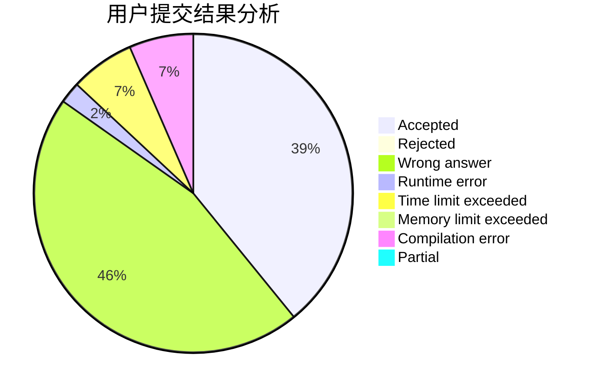
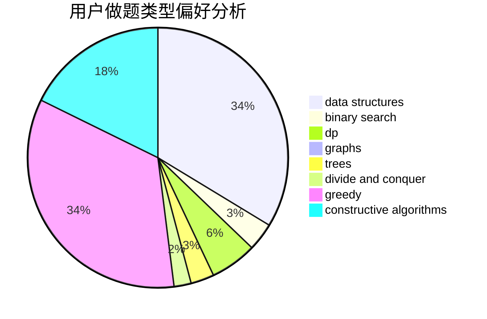
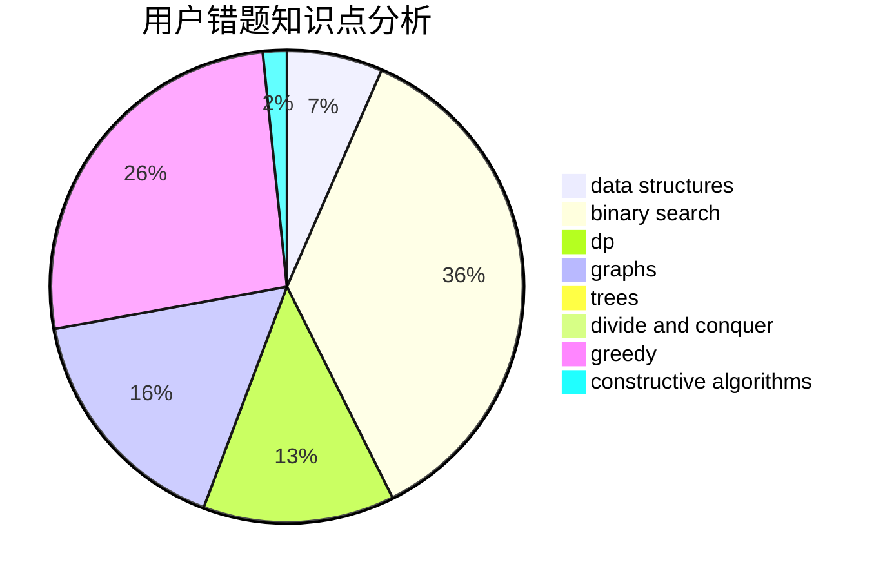

# 1739206233

<!-- tabs:start -->

#### **用户提交结果分析**

#### **用户做题类型偏好分析**

#### **用户错题知识点分析**

<!-- tabs:end -->
# 推荐题目
[1175C](https://codeforces.com/contest/1175/problem/C)		binary search,
                        brute force,
                        greedy		  
[1175B](https://codeforces.com/contest/1175/problem/B)		data structures,
                        expression parsing,
                        implementation		  
[1168E](https://codeforces.com/contest/1168/problem/E)		constructive algorithms,
                        math		  
[1174A](https://codeforces.com/contest/1174/problem/A)		constructive algorithms,
                        greedy,
                        sortings		  
[1173A](https://codeforces.com/contest/1173/problem/A)		greedy		  
[1167C](https://codeforces.com/contest/1167/problem/C)		dfs and similar,
                        dsu,
                        graphs		  
[1167D](https://codeforces.com/contest/1167/problem/D)		constructive algorithms,
                        greedy		  
[1168C](https://codeforces.com/contest/1168/problem/C)		bitmasks,
                        dp		  
[1174C](https://codeforces.com/contest/1174/problem/C)		constructive algorithms,
                        number theory		  
[1173B](https://codeforces.com/contest/1173/problem/B)		constructive algorithms,
                        greedy		  
