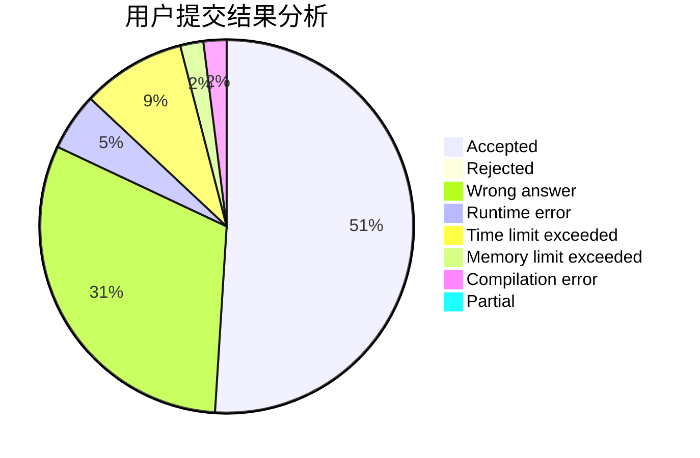
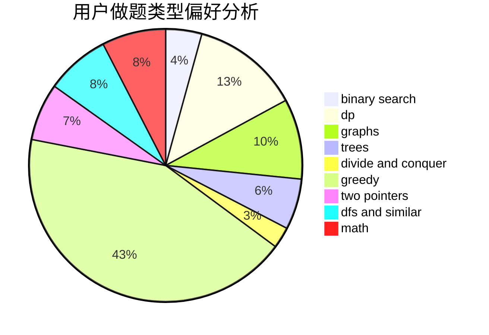

# Celtic

<!-- tabs:start -->

#### **用户提交结果分析**

#### **用户做题类型偏好分析**

<!-- tabs:end -->
# 推荐题目
[682D](https://codeforces.com/contest/682/problem/D)
[581B](https://codeforces.com/contest/581/problem/B)
[682E](https://codeforces.com/contest/682/problem/E)
[683B](https://codeforces.com/contest/683/problem/B)
[683A](https://codeforces.com/contest/683/problem/A)
[1380G](https://codeforces.com/contest/1380/problem/G)
[1151D](https://codeforces.com/contest/1151/problem/D)
[1119G](https://codeforces.com/contest/1119/problem/G)
[325D](https://codeforces.com/contest/325/problem/D)
[439C](https://codeforces.com/contest/439/problem/C)
