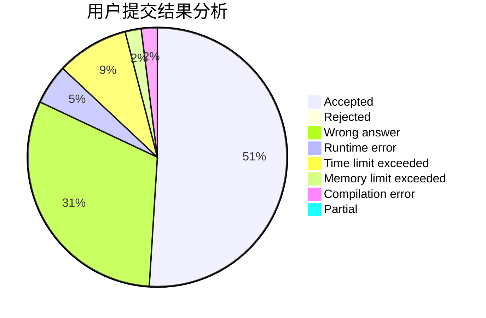
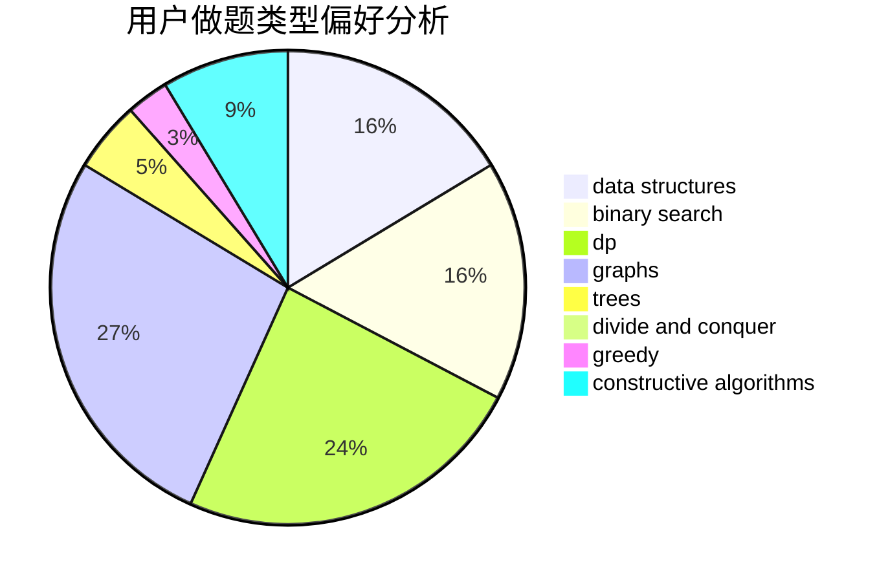

# Celtic

<!-- tabs:start -->

#### **用户提交结果分析**

#### **用户做题类型偏好分析**

#### **用户错题知识点分析**

<!-- tabs:end -->
# 推荐题目
[682D](https://codeforces.com/contest/682/problem/D)		dp,
                        strings		  
[581B](https://codeforces.com/contest/581/problem/B)		implementation,
                        math		  
[682E](https://codeforces.com/contest/682/problem/E)		geometry,
                        two pointers		  
[683B](https://codeforces.com/contest/683/problem/B)		*special problem		  
[683A](https://codeforces.com/contest/683/problem/A)		*special problem,
                        geometry		  
[1380G](https://codeforces.com/contest/1380/problem/G)		greedy,
                        math,
                        probabilities		  
[1151D](https://codeforces.com/contest/1151/problem/D)		greedy,
                        math,
                        sortings		  
[1119G](https://codeforces.com/contest/1119/problem/G)		constructive algorithms,
                        implementation		  
[325D](https://codeforces.com/contest/325/problem/D)		dsu		  
[439C](https://codeforces.com/contest/439/problem/C)		brute force,
                        constructive algorithms,
                        implementation,
                        number theory		  
