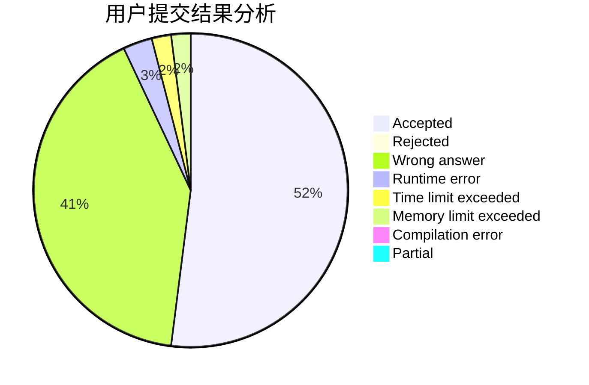
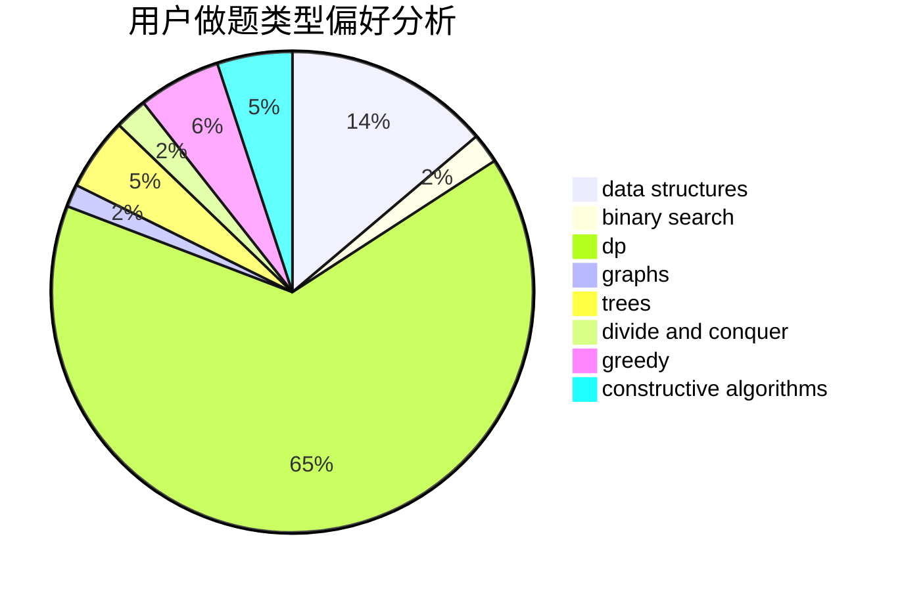
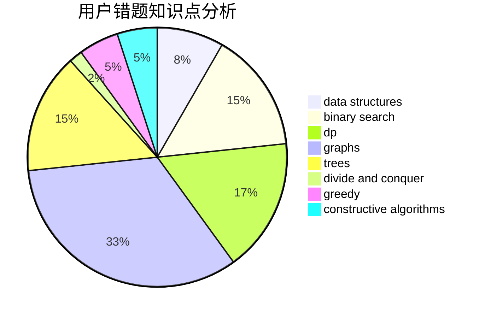

# yan_qiu_ynlchrz

<!-- tabs:start -->

#### **用户提交结果分析**

#### **用户做题类型偏好分析**

#### **用户错题知识点分析**

<!-- tabs:end -->
# 推荐题目
[1499F](https://codeforces.com/contest/1499/problem/F)		combinatorics,
                        dfs and similar,
                        dp,
                        trees		  
[1438A](https://codeforces.com/contest/1438/problem/A)		constructive algorithms,
                        implementation		  
[814C](https://codeforces.com/contest/814/problem/C)		brute force,
                        dp,
                        strings,
                        two pointers		  
[994B](https://codeforces.com/contest/994/problem/B)		greedy,
                        implementation,
                        sortings		  
[183A](https://codeforces.com/contest/183/problem/A)		constructive algorithms,
                        math		  
[144B](https://codeforces.com/contest/144/problem/B)		implementation		  
[1088F](https://codeforces.com/contest/1088/problem/F)		data structures,
                        trees		  
[225D](https://codeforces.com/contest/225/problem/D)		bitmasks,
                        dfs and similar,
                        graphs,
                        implementation		  
[1248E](https://codeforces.com/contest/1248/problem/E)		dsu,graphs,sortings,trees		  
[113C](https://codeforces.com/contest/113/problem/C)		brute force,
                        math,
                        number theory		  
