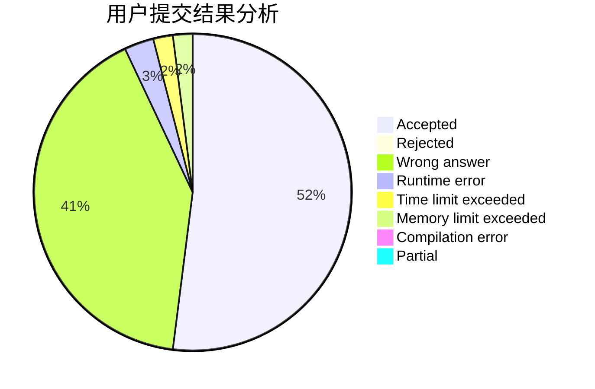
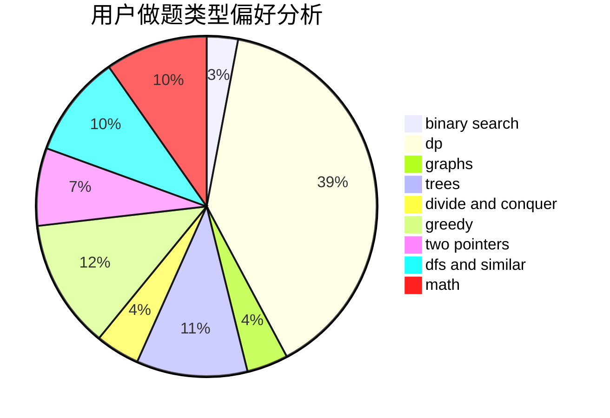

# yan_qiu_ynlchrz

<!-- tabs:start -->

#### **用户提交结果分析**

#### **用户做题类型偏好分析**

<!-- tabs:end -->
# 推荐题目
[1499F](https://codeforces.com/contest/1499/problem/F)
[1438A](https://codeforces.com/contest/1438/problem/A)
[814C](https://codeforces.com/contest/814/problem/C)
[994B](https://codeforces.com/contest/994/problem/B)
[183A](https://codeforces.com/contest/183/problem/A)
[144B](https://codeforces.com/contest/144/problem/B)
[1088F](https://codeforces.com/contest/1088/problem/F)
[225D](https://codeforces.com/contest/225/problem/D)
[1248E](https://codeforces.com/contest/1248/problem/E)
[113C](https://codeforces.com/contest/113/problem/C)
