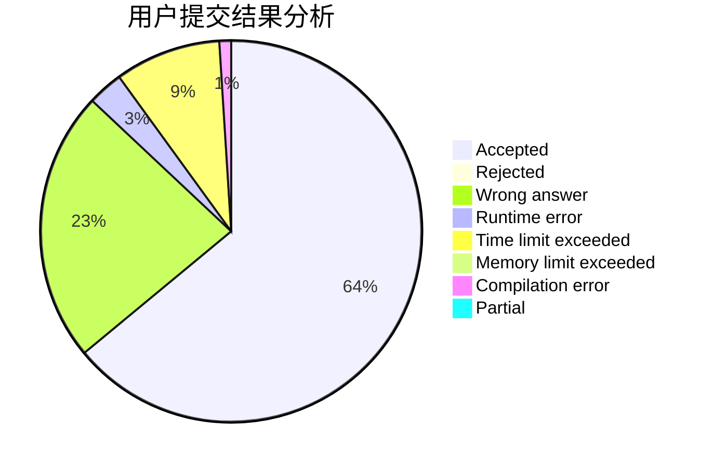
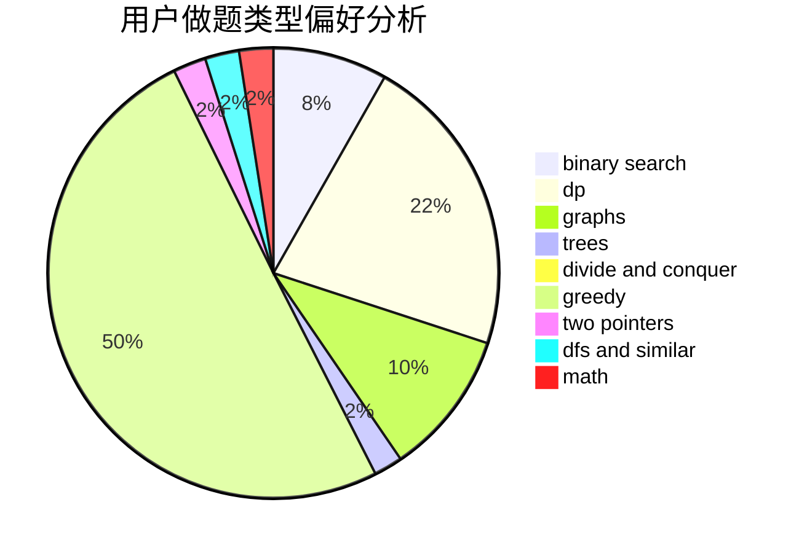

# yang12138

<!-- tabs:start -->

#### **用户提交结果分析**

#### **用户做题类型偏好分析**

<!-- tabs:end -->
# 推荐题目
[11411](https://codeforces.com/contest/1141/problem/1)
[1257E](https://codeforces.com/contest/1257/problem/E)
[25A](https://codeforces.com/contest/25/problem/A)
[843A](https://codeforces.com/contest/843/problem/A)
[7E](https://codeforces.com/contest/7/problem/E)
[1225A](https://codeforces.com/contest/1225/problem/A)
[901C](https://codeforces.com/contest/901/problem/C)
[315A](https://codeforces.com/contest/315/problem/A)
[779C](https://codeforces.com/contest/779/problem/C)
[1209F](https://codeforces.com/contest/1209/problem/F)
