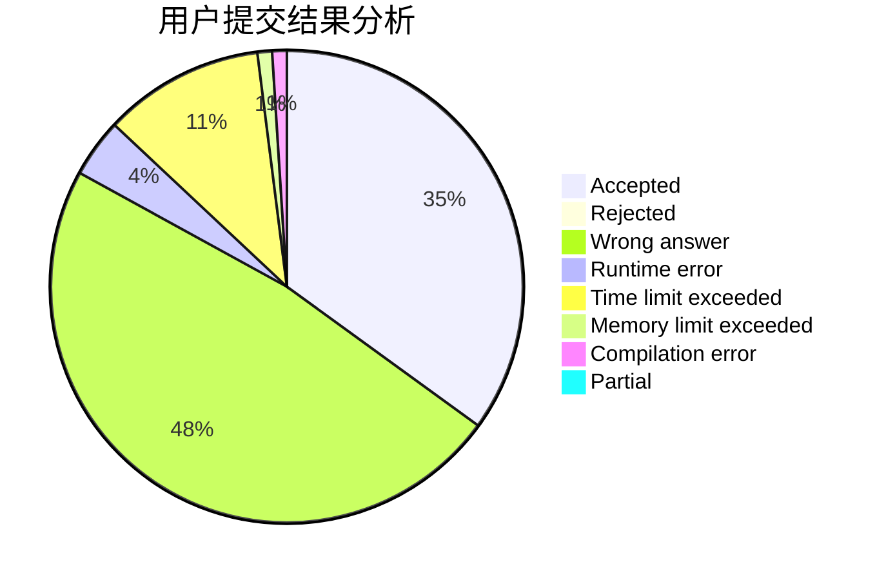
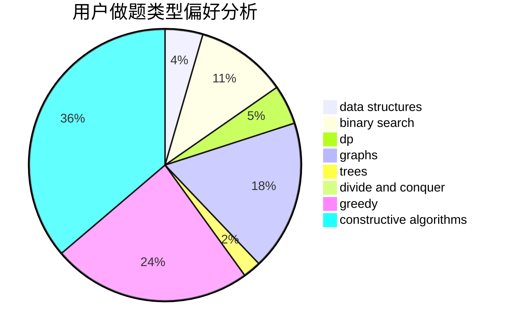

# yanghy

<!-- tabs:start -->

#### **用户提交结果分析**

#### **用户做题类型偏好分析**

#### **用户错题知识点分析**

<!-- tabs:end -->
# 推荐题目
[777A](https://codeforces.com/contest/777/problem/A)		constructive algorithms,
                        implementation,
                        math		  
[924A](https://codeforces.com/contest/924/problem/A)		greedy,
                        implementation		  
[747D](https://codeforces.com/contest/747/problem/D)		dp,
                        greedy,
                        sortings		  
[479C](https://codeforces.com/contest/479/problem/C)		greedy,
                        sortings		  
[1041C](https://codeforces.com/contest/1041/problem/C)		binary search,
                        data structures,
                        greedy,
                        two pointers		  
[370B](https://codeforces.com/contest/370/problem/B)		implementation		  
[509D](https://codeforces.com/contest/509/problem/D)		constructive algorithms,
                        math		  
[97C](https://codeforces.com/contest/97/problem/C)		binary search,
                        graphs,
                        math,
                        shortest paths		  
[925F](https://codeforces.com/contest/925/problem/F)		binary search,
                        flows		  
[430A](https://codeforces.com/contest/430/problem/A)		constructive algorithms,
                        sortings		  
