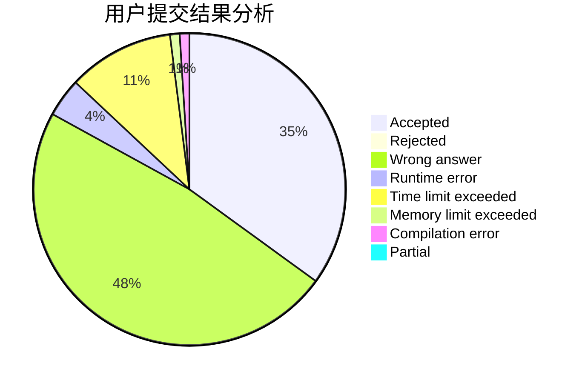
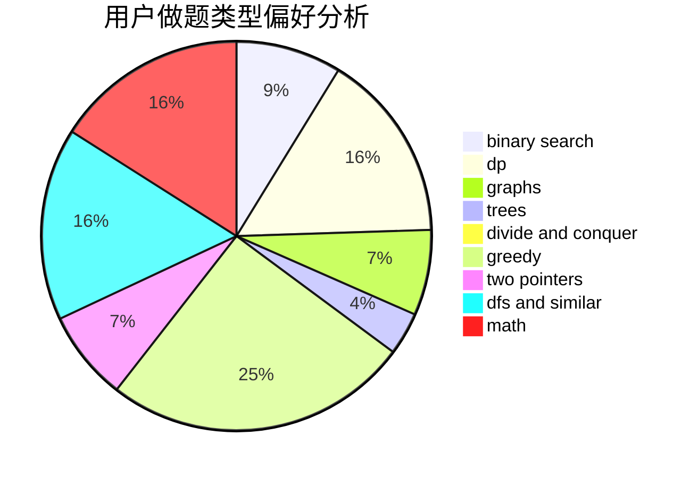

# yanghy

<!-- tabs:start -->

#### **用户提交结果分析**

#### **用户做题类型偏好分析**

<!-- tabs:end -->
# 推荐题目
[794G](https://codeforces.com/contest/794/problem/G)
[947D](https://codeforces.com/contest/947/problem/D)
[767A](https://codeforces.com/contest/767/problem/A)
[49E](https://codeforces.com/contest/49/problem/E)
[1041F](https://codeforces.com/contest/1041/problem/F)
[3D](https://codeforces.com/contest/3/problem/D)
[52C](https://codeforces.com/contest/52/problem/C)
[994C](https://codeforces.com/contest/994/problem/C)
[949C](https://codeforces.com/contest/949/problem/C)
[452B](https://codeforces.com/contest/452/problem/B)
