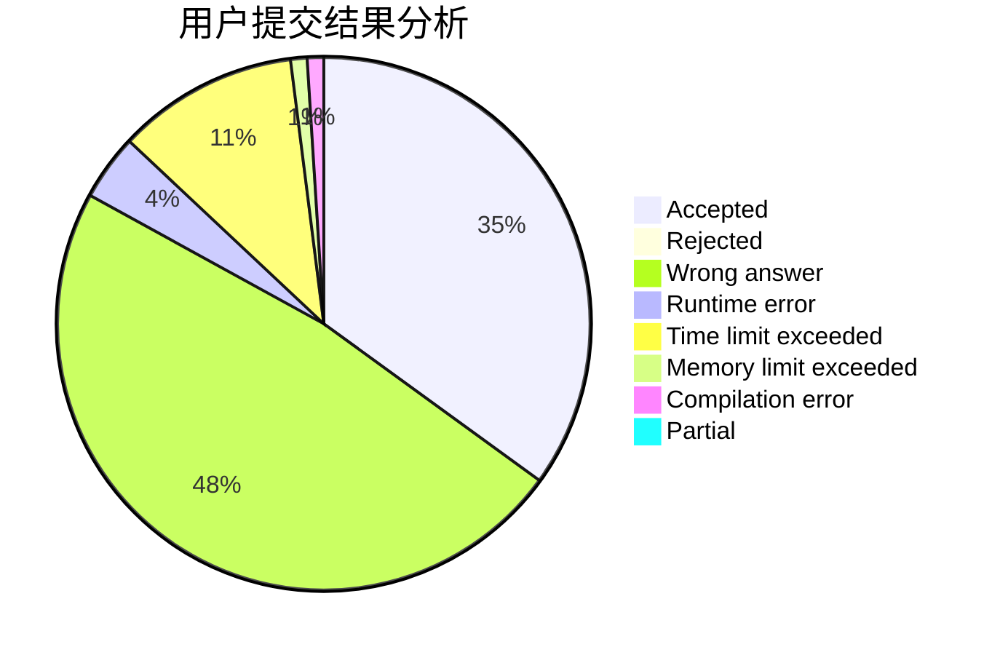
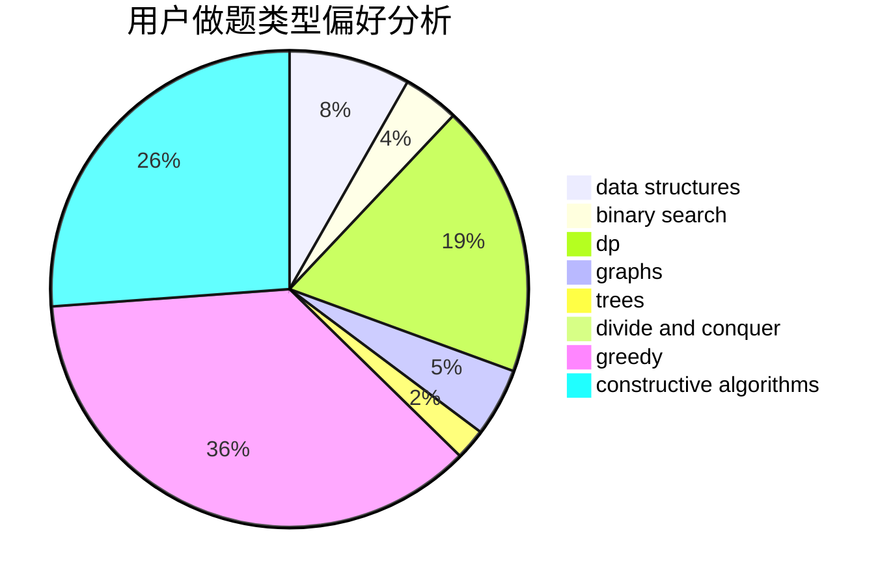

# yanghy

<!-- tabs:start -->

#### **用户提交结果分析**

#### **用户做题类型偏好分析**

#### **用户错题知识点分析**

<!-- tabs:end -->
# 推荐题目
[794G](https://codeforces.com/contest/794/problem/G)		combinatorics,
                        dp,
                        math		  
[947D](https://codeforces.com/contest/947/problem/D)		dsu,graphs,sortings,trees		  
[767A](https://codeforces.com/contest/767/problem/A)		data structures,
                        implementation		  
[49E](https://codeforces.com/contest/49/problem/E)		dp		  
[1041F](https://codeforces.com/contest/1041/problem/F)		data structures,
                        divide and conquer,
                        dp,
                        math		  
[3D](https://codeforces.com/contest/3/problem/D)		greedy		  
[52C](https://codeforces.com/contest/52/problem/C)		data structures		  
[994C](https://codeforces.com/contest/994/problem/C)		dsu,graphs,sortings,trees		  
[949C](https://codeforces.com/contest/949/problem/C)		dfs and similar,
                        graphs		  
[452B](https://codeforces.com/contest/452/problem/B)		brute force,
                        constructive algorithms,
                        geometry,
                        trees		  
