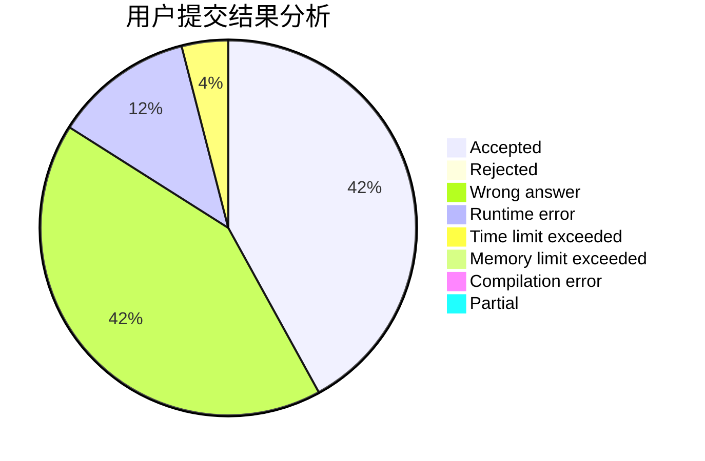
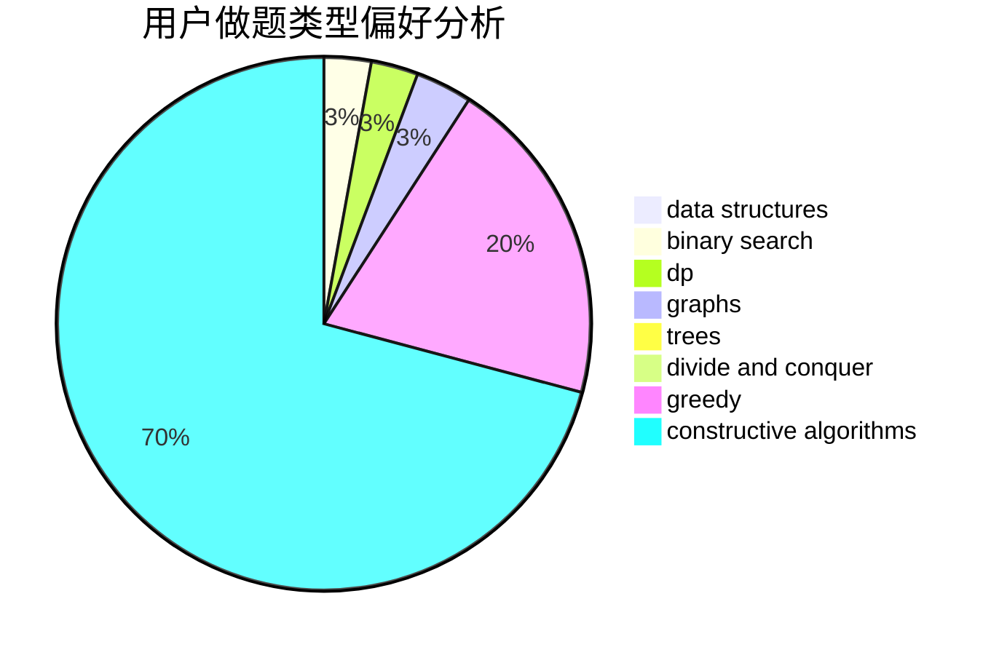
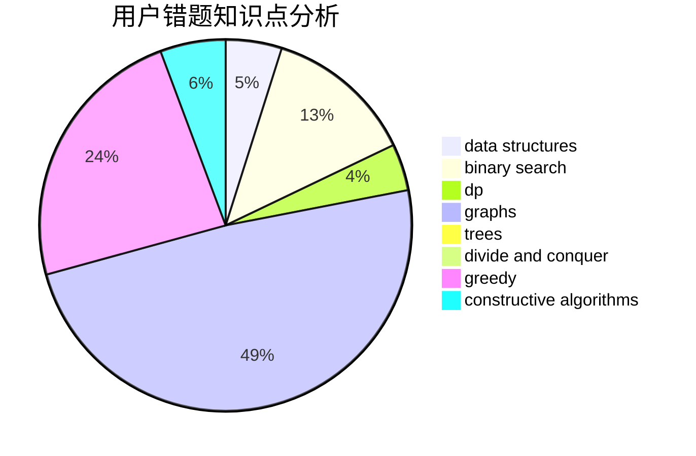

# yangjz

<!-- tabs:start -->

#### **用户提交结果分析**

#### **用户做题类型偏好分析**

#### **用户错题知识点分析**

<!-- tabs:end -->
# 推荐题目
[514D](https://codeforces.com/contest/514/problem/D)		binary search,
                        data structures,
                        two pointers		  
[1075A](https://codeforces.com/contest/1075/problem/A)		implementation,
                        math		  
[641E](https://codeforces.com/contest/641/problem/E)		data structures		  
[834C](https://codeforces.com/contest/834/problem/C)		dsu,graphs,sortings,trees		  
[549C](https://codeforces.com/contest/549/problem/C)		games		  
[1175G](https://codeforces.com/contest/1175/problem/G)		data structures,
                        divide and conquer,
                        dp,
                        geometry,
                        two pointers		  
[38B](https://codeforces.com/contest/38/problem/B)		brute force,
                        implementation,
                        math		  
[1188C](https://codeforces.com/contest/1188/problem/C)		dp		  
[605C](https://codeforces.com/contest/605/problem/C)		geometry		  
[809A](https://codeforces.com/contest/809/problem/A)		implementation,
                        math,
                        sortings		  
