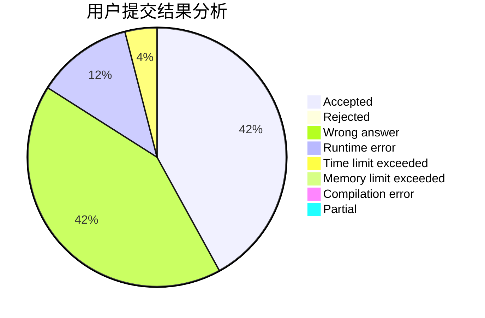
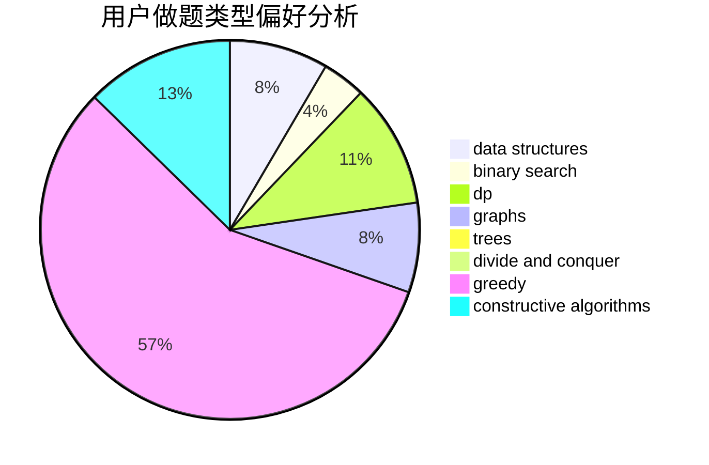
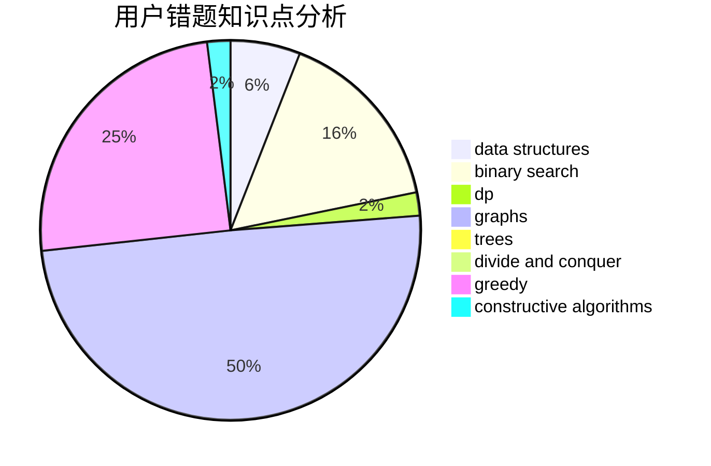

# yangjz

<!-- tabs:start -->

#### **用户提交结果分析**

#### **用户做题类型偏好分析**

#### **用户错题知识点分析**

<!-- tabs:end -->
# 推荐题目
[540B](https://codeforces.com/contest/540/problem/B)		greedy,
                        implementation		  
[1076C](https://codeforces.com/contest/1076/problem/C)		binary search,
                        math		  
[6702](https://codeforces.com/contest/670/problem/2)		dsu,graphs,sortings,trees		  
[852D](https://codeforces.com/contest/852/problem/D)		binary search,
                        flows,
                        graph matchings,
                        shortest paths		  
[574B](https://codeforces.com/contest/574/problem/B)		brute force,
                        dfs and similar,
                        graphs,
                        hashing		  
[1179A](https://codeforces.com/contest/1179/problem/A)		data structures,
                        implementation		  
[41A](https://codeforces.com/contest/41/problem/A)		implementation,
                        strings		  
[1193A](https://codeforces.com/contest/1193/problem/A)		*special problem,
                        dp,
                        math		  
[623C](https://codeforces.com/contest/623/problem/C)		binary search,
                        dp		  
[825G](https://codeforces.com/contest/825/problem/G)		dfs and similar,
                        graphs,
                        trees		  
