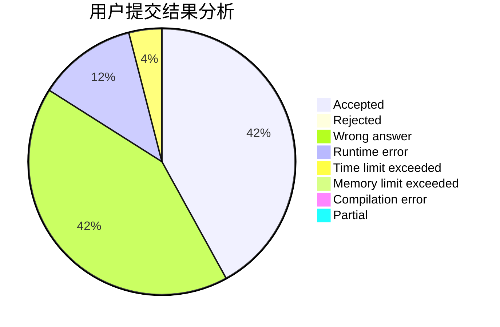
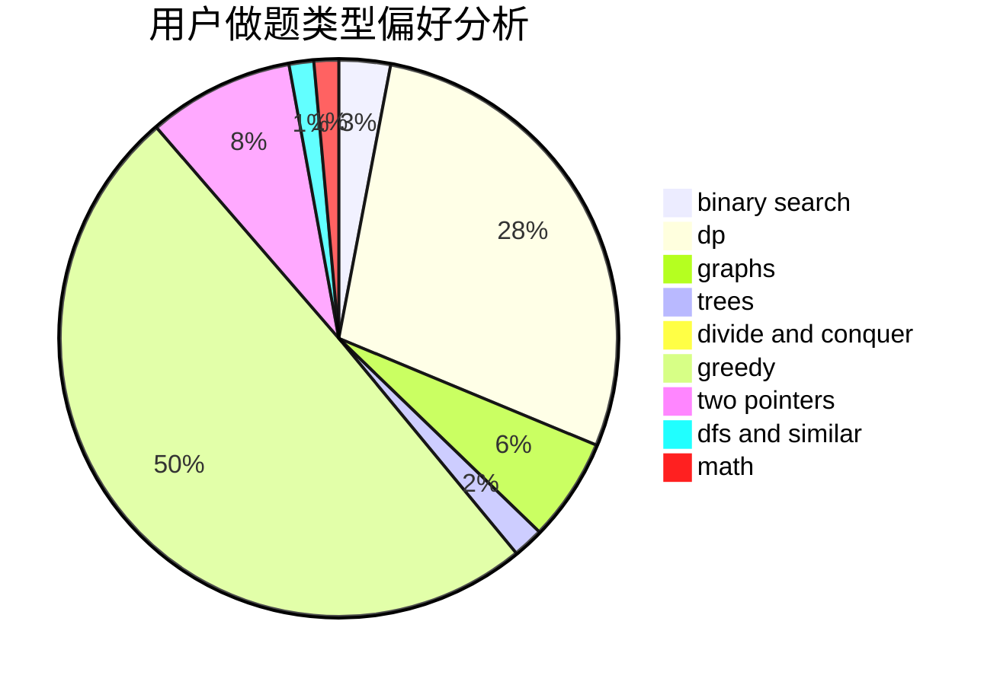

# yangjz

<!-- tabs:start -->

#### **用户提交结果分析**

#### **用户做题类型偏好分析**

<!-- tabs:end -->
# 推荐题目
[540B](https://codeforces.com/contest/540/problem/B)
[1076C](https://codeforces.com/contest/1076/problem/C)
[6702](https://codeforces.com/contest/670/problem/2)
[852D](https://codeforces.com/contest/852/problem/D)
[574B](https://codeforces.com/contest/574/problem/B)
[1179A](https://codeforces.com/contest/1179/problem/A)
[41A](https://codeforces.com/contest/41/problem/A)
[1193A](https://codeforces.com/contest/1193/problem/A)
[623C](https://codeforces.com/contest/623/problem/C)
[825G](https://codeforces.com/contest/825/problem/G)
