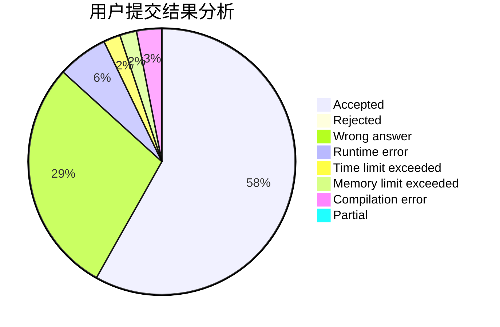
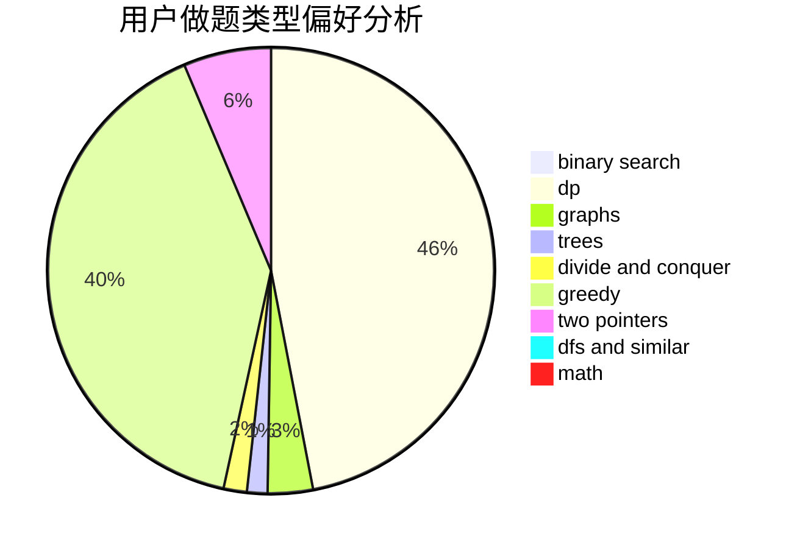

# yangqianrui

<!-- tabs:start -->

#### **用户提交结果分析**

#### **用户做题类型偏好分析**

<!-- tabs:end -->
# 推荐题目
[722D](https://codeforces.com/contest/722/problem/D)
[27A](https://codeforces.com/contest/27/problem/A)
[176D](https://codeforces.com/contest/176/problem/D)
[737C](https://codeforces.com/contest/737/problem/C)
[621B](https://codeforces.com/contest/621/problem/B)
[1503F](https://codeforces.com/contest/1503/problem/F)
[278B](https://codeforces.com/contest/278/problem/B)
[50D](https://codeforces.com/contest/50/problem/D)
[167B](https://codeforces.com/contest/167/problem/B)
[1465B](https://codeforces.com/contest/1465/problem/B)
