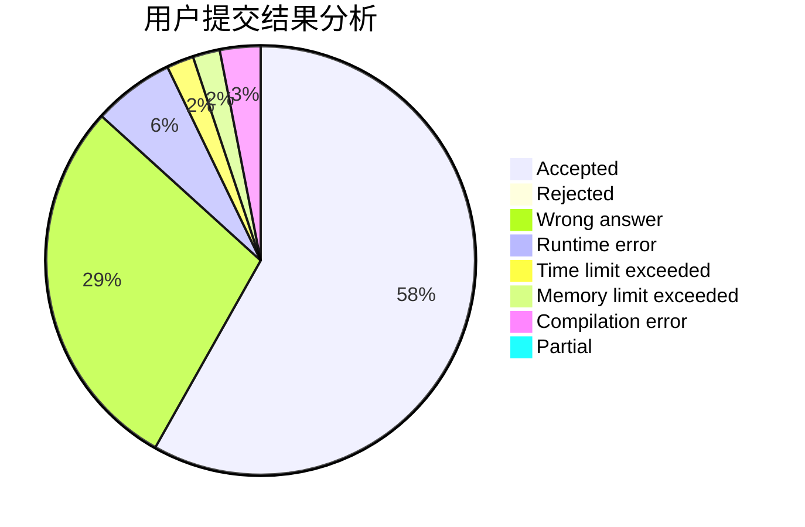
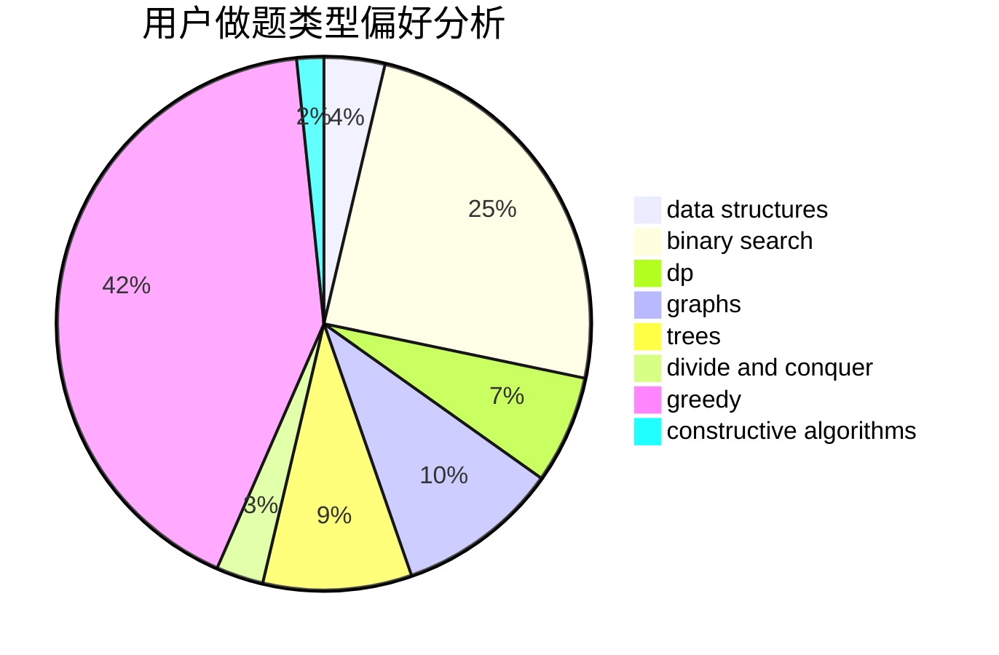
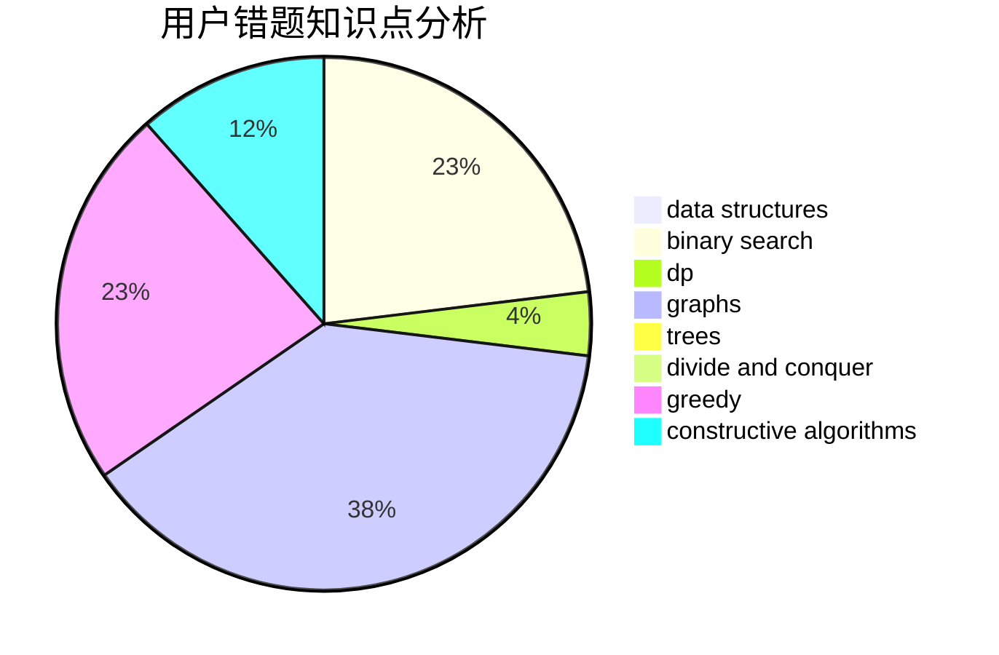

# yangqianrui

<!-- tabs:start -->

#### **用户提交结果分析**

#### **用户做题类型偏好分析**

#### **用户错题知识点分析**

<!-- tabs:end -->
# 推荐题目
[703C](https://codeforces.com/contest/703/problem/C)		geometry,
                        implementation		  
[261C](https://codeforces.com/contest/261/problem/C)		constructive algorithms,
                        dp,
                        math		  
[155A](https://codeforces.com/contest/155/problem/A)		brute force		  
[720C](https://codeforces.com/contest/720/problem/C)		constructive algorithms		  
[602A](https://codeforces.com/contest/602/problem/A)		brute force,
                        implementation		  
[1494F](https://codeforces.com/contest/1494/problem/F)		brute force,
                        constructive algorithms,
                        dfs and similar,
                        graphs,
                        implementation		  
[260A](https://codeforces.com/contest/260/problem/A)		implementation,
                        math		  
[489F](https://codeforces.com/contest/489/problem/F)		combinatorics,
                        dp		  
[1511A](https://codeforces.com/contest/1511/problem/A)		greedy		  
[1455E](https://codeforces.com/contest/1455/problem/E)		brute force,
                        constructive algorithms,
                        flows,
                        geometry,
                        greedy,
                        implementation,
                        math,
                        ternary search		  
