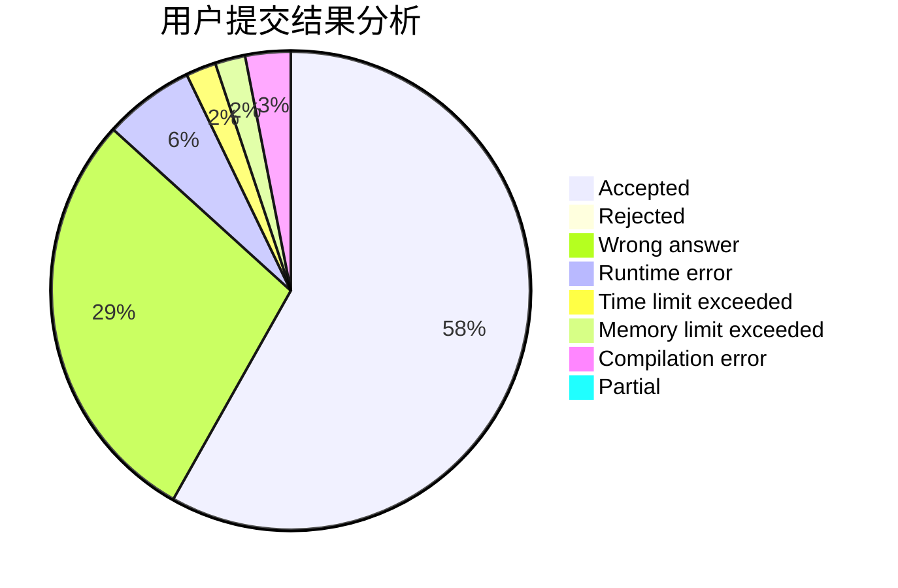
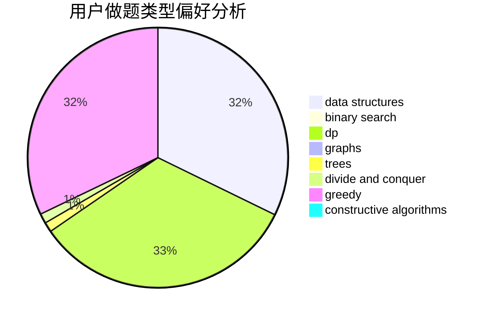
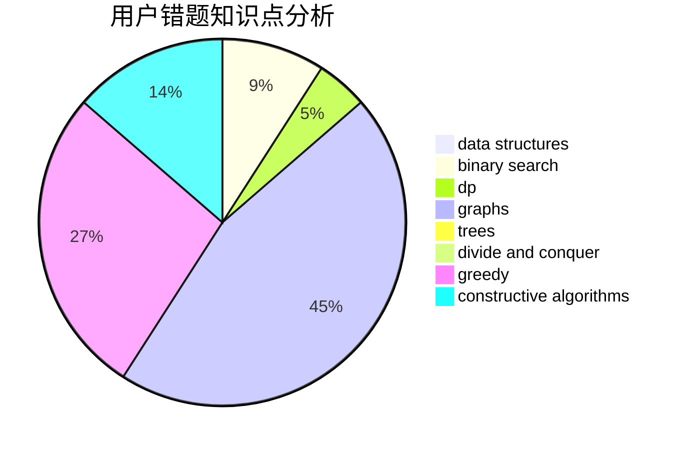

# yangqianrui

<!-- tabs:start -->

#### **用户提交结果分析**

#### **用户做题类型偏好分析**

#### **用户错题知识点分析**

<!-- tabs:end -->
# 推荐题目
[722D](https://codeforces.com/contest/722/problem/D)		binary search,
                        data structures,
                        dfs and similar,
                        greedy,
                        strings,
                        trees		  
[27A](https://codeforces.com/contest/27/problem/A)		implementation,
                        sortings		  
[176D](https://codeforces.com/contest/176/problem/D)		dp		  
[737C](https://codeforces.com/contest/737/problem/C)		dsu,graphs,sortings,trees		  
[621B](https://codeforces.com/contest/621/problem/B)		combinatorics,
                        implementation		  
[1503F](https://codeforces.com/contest/1503/problem/F)		constructive algorithms,
                        data structures,
                        divide and conquer,
                        geometry,
                        graphs,
                        implementation		  
[278B](https://codeforces.com/contest/278/problem/B)		brute force,
                        strings		  
[50D](https://codeforces.com/contest/50/problem/D)		binary search,
                        dp,
                        probabilities		  
[167B](https://codeforces.com/contest/167/problem/B)		dp,
                        math,
                        probabilities		  
[1465B](https://codeforces.com/contest/1465/problem/B)		dsu,graphs,sortings,trees		  
