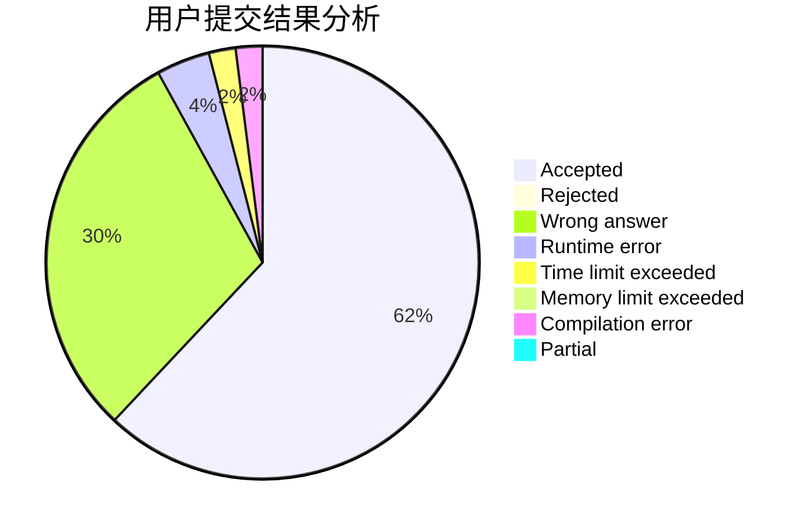
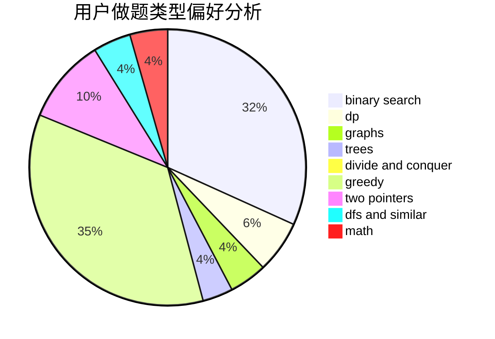

# yangzhou

<!-- tabs:start -->

#### **用户提交结果分析**

#### **用户做题类型偏好分析**

<!-- tabs:end -->
# 推荐题目
[1407C](https://codeforces.com/contest/1407/problem/C)
[1217E](https://codeforces.com/contest/1217/problem/E)
[677C](https://codeforces.com/contest/677/problem/C)
[18C](https://codeforces.com/contest/18/problem/C)
[67B](https://codeforces.com/contest/67/problem/B)
[1067C](https://codeforces.com/contest/1067/problem/C)
[292E](https://codeforces.com/contest/292/problem/E)
[1059D](https://codeforces.com/contest/1059/problem/D)
[895E](https://codeforces.com/contest/895/problem/E)
[447E](https://codeforces.com/contest/447/problem/E)
