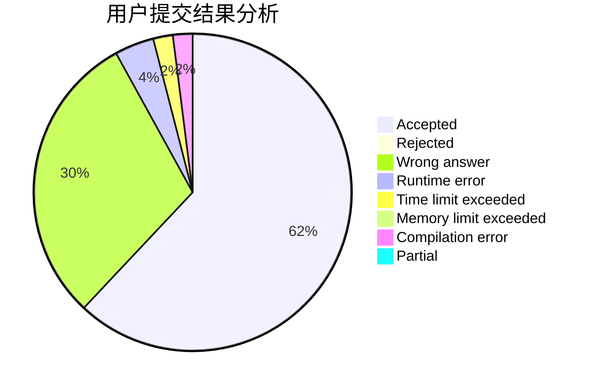
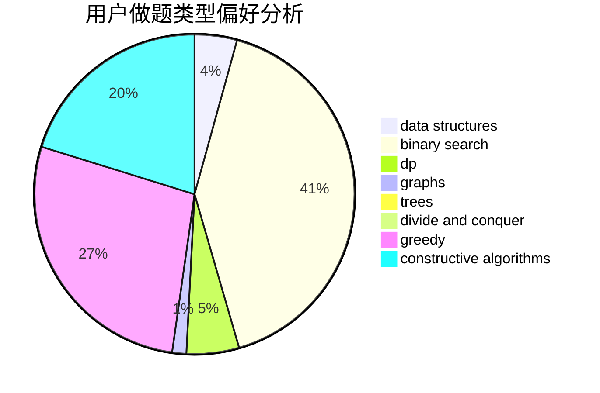

# yangzhou

<!-- tabs:start -->

#### **用户提交结果分析**

#### **用户做题类型偏好分析**

#### **用户错题知识点分析**

<!-- tabs:end -->
# 推荐题目
[1407C](https://codeforces.com/contest/1407/problem/C)		constructive algorithms,
                        interactive,
                        math,
                        two pointers		  
[1217E](https://codeforces.com/contest/1217/problem/E)		data structures,
                        greedy,
                        implementation,
                        math		  
[677C](https://codeforces.com/contest/677/problem/C)		bitmasks,
                        combinatorics,
                        implementation,
                        strings		  
[18C](https://codeforces.com/contest/18/problem/C)		data structures,
                        implementation		  
[67B](https://codeforces.com/contest/67/problem/B)		greedy		  
[1067C](https://codeforces.com/contest/1067/problem/C)		constructive algorithms		  
[292E](https://codeforces.com/contest/292/problem/E)		data structures		  
[1059D](https://codeforces.com/contest/1059/problem/D)		binary search,
                        geometry,
                        ternary search		  
[895E](https://codeforces.com/contest/895/problem/E)		data structures,
                        probabilities		  
[447E](https://codeforces.com/contest/447/problem/E)		dsu,graphs,sortings,trees		  
