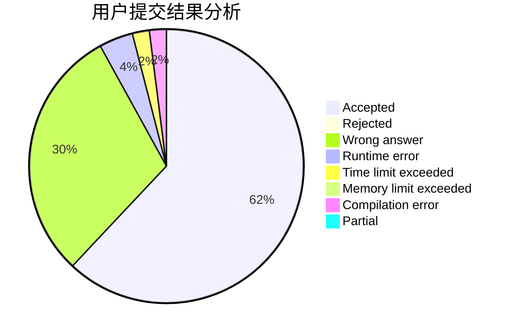
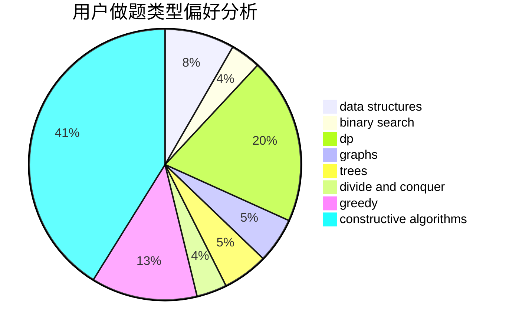

# yangzhou

<!-- tabs:start -->

#### **用户提交结果分析**

#### **用户做题类型偏好分析**

#### **用户错题知识点分析**

<!-- tabs:end -->
# 推荐题目
[1398D](https://codeforces.com/contest/1398/problem/D)		dp,
                        greedy,
                        sortings		  
[1213C](https://codeforces.com/contest/1213/problem/C)		math		  
[653C](https://codeforces.com/contest/653/problem/C)		brute force,
                        implementation		  
[165A](https://codeforces.com/contest/165/problem/A)		implementation		  
[659G](https://codeforces.com/contest/659/problem/G)		combinatorics,
                        dp,
                        number theory		  
[1066F](https://codeforces.com/contest/1066/problem/F)		dp		  
[277D](https://codeforces.com/contest/277/problem/D)		dp,
                        probabilities		  
[1059A](https://codeforces.com/contest/1059/problem/A)		implementation		  
[875E](https://codeforces.com/contest/875/problem/E)		binary search,
                        data structures,
                        dp		  
[424D](https://codeforces.com/contest/424/problem/D)		binary search,
                        brute force,
                        constructive algorithms,
                        data structures,
                        dp		  
