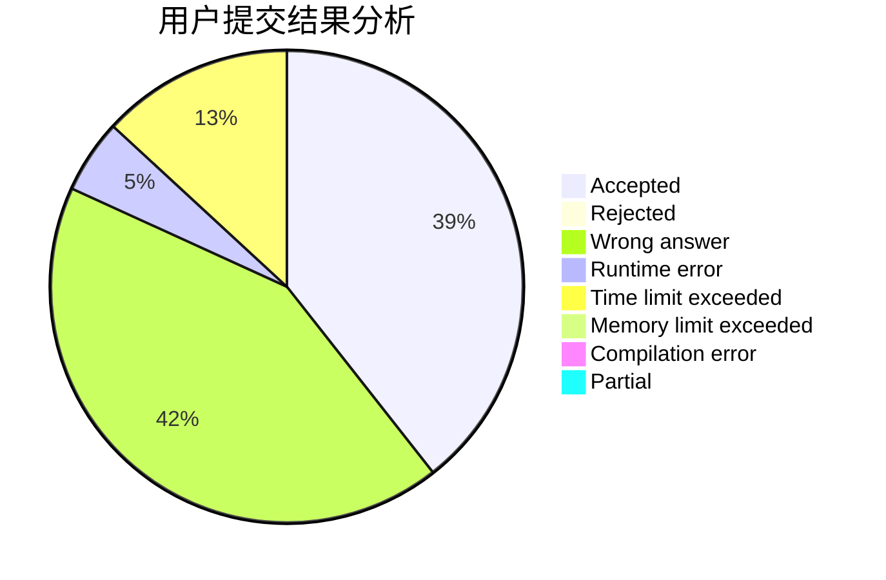
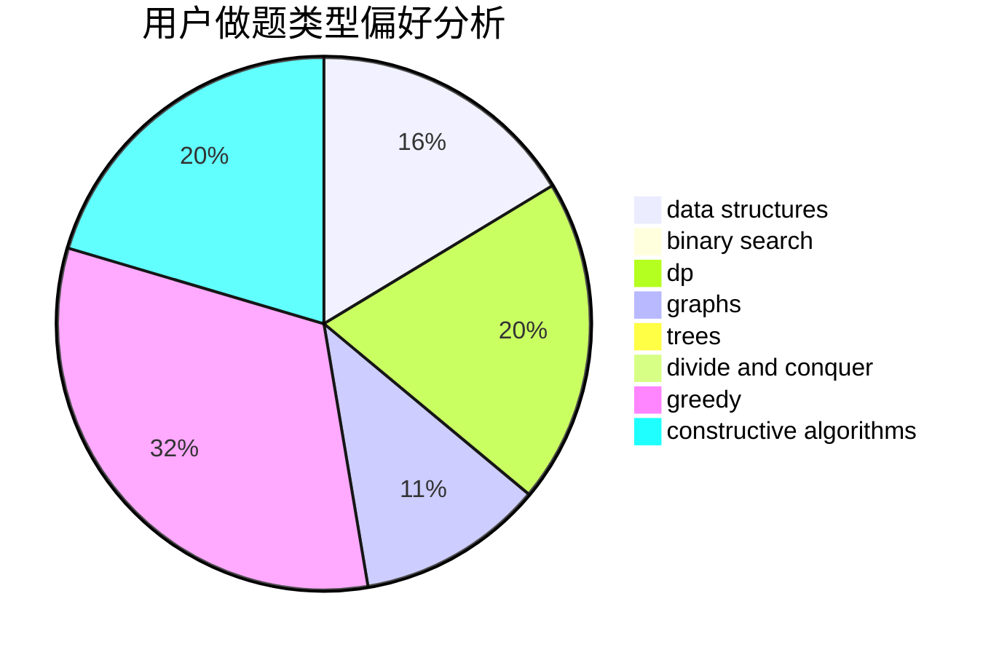
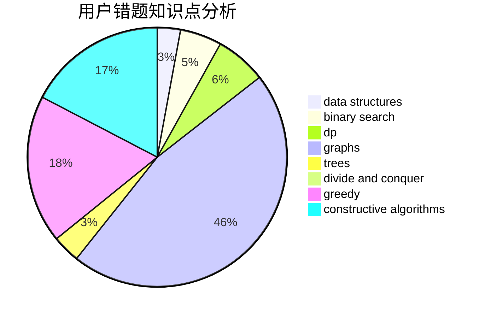

# yangzijun

<!-- tabs:start -->

#### **用户提交结果分析**

#### **用户做题类型偏好分析**

#### **用户错题知识点分析**

<!-- tabs:end -->
# 推荐题目
[38A](https://codeforces.com/contest/38/problem/A)		implementation		  
[1186D](https://codeforces.com/contest/1186/problem/D)		constructive algorithms,
                        greedy,
                        math		  
[833A](https://codeforces.com/contest/833/problem/A)		math,
                        number theory		  
[558A](https://codeforces.com/contest/558/problem/A)		brute force,
                        implementation,
                        sortings		  
[193B](https://codeforces.com/contest/193/problem/B)		brute force		  
[898B](https://codeforces.com/contest/898/problem/B)		brute force,
                        implementation,
                        number theory		  
[961B](https://codeforces.com/contest/961/problem/B)		data structures,
                        dp,
                        implementation,
                        two pointers		  
[1129B](https://codeforces.com/contest/1129/problem/B)		constructive algorithms		  
[295C](https://codeforces.com/contest/295/problem/C)		combinatorics,
                        dp,
                        graphs,
                        shortest paths		  
[1136D](https://codeforces.com/contest/1136/problem/D)		greedy		  
