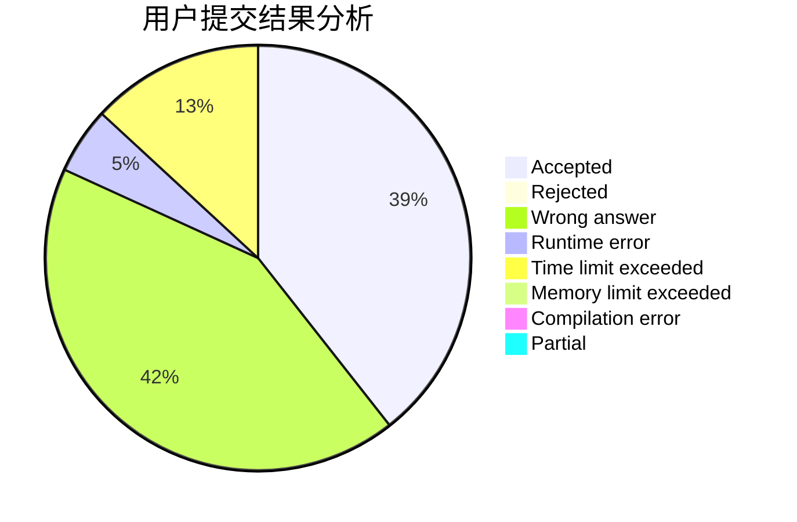
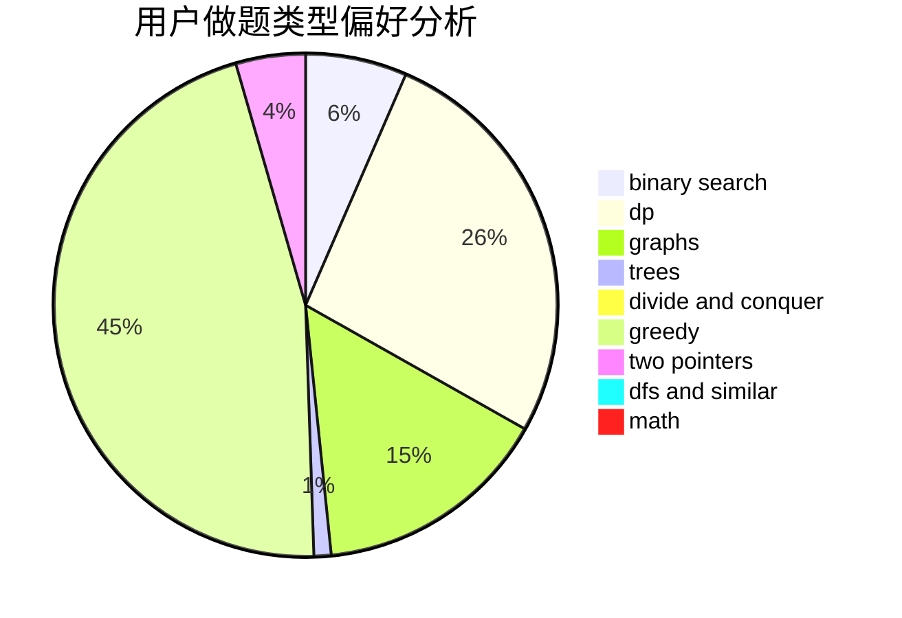

# yangzijun

<!-- tabs:start -->

#### **用户提交结果分析**

#### **用户做题类型偏好分析**

<!-- tabs:end -->
# 推荐题目
[38A](https://codeforces.com/contest/38/problem/A)
[1186D](https://codeforces.com/contest/1186/problem/D)
[833A](https://codeforces.com/contest/833/problem/A)
[558A](https://codeforces.com/contest/558/problem/A)
[193B](https://codeforces.com/contest/193/problem/B)
[898B](https://codeforces.com/contest/898/problem/B)
[961B](https://codeforces.com/contest/961/problem/B)
[1129B](https://codeforces.com/contest/1129/problem/B)
[295C](https://codeforces.com/contest/295/problem/C)
[1136D](https://codeforces.com/contest/1136/problem/D)
