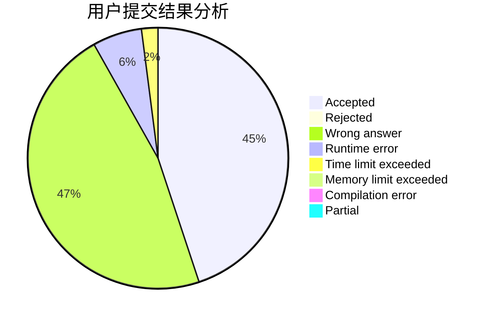
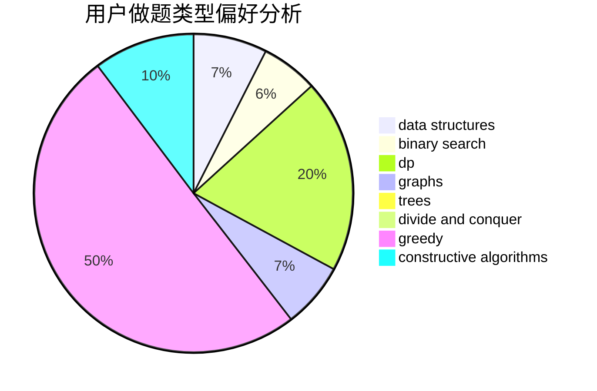
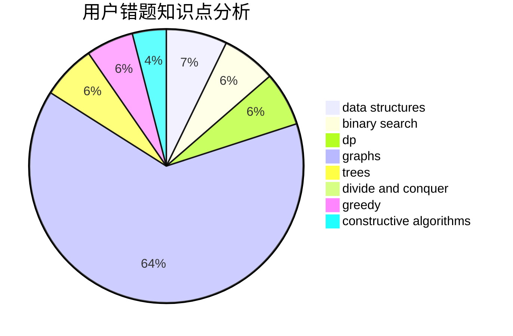

# yanjunjie

<!-- tabs:start -->

#### **用户提交结果分析**

#### **用户做题类型偏好分析**

#### **用户错题知识点分析**

<!-- tabs:end -->
# 推荐题目
[1359C](https://codeforces.com/contest/1359/problem/C)		binary search,
                        math		  
[792C](https://codeforces.com/contest/792/problem/C)		dp,
                        greedy,
                        math,
                        number theory		  
[1111C](https://codeforces.com/contest/1111/problem/C)		binary search,
                        brute force,
                        divide and conquer,
                        math		  
[914F](https://codeforces.com/contest/914/problem/F)		bitmasks,
                        brute force,
                        data structures,
                        string suffix structures,
                        strings		  
[1365A](https://codeforces.com/contest/1365/problem/A)		games,
                        greedy,
                        implementation		  
[850D](https://codeforces.com/contest/850/problem/D)		constructive algorithms,
                        dp,
                        graphs,
                        greedy,
                        math		  
[288D](https://codeforces.com/contest/288/problem/D)		combinatorics,
                        dfs and similar,
                        trees		  
[1102D](https://codeforces.com/contest/1102/problem/D)		greedy,
                        strings		  
[935C](https://codeforces.com/contest/935/problem/C)		geometry		  
[251A](https://codeforces.com/contest/251/problem/A)		binary search,
                        combinatorics,
                        two pointers		  
