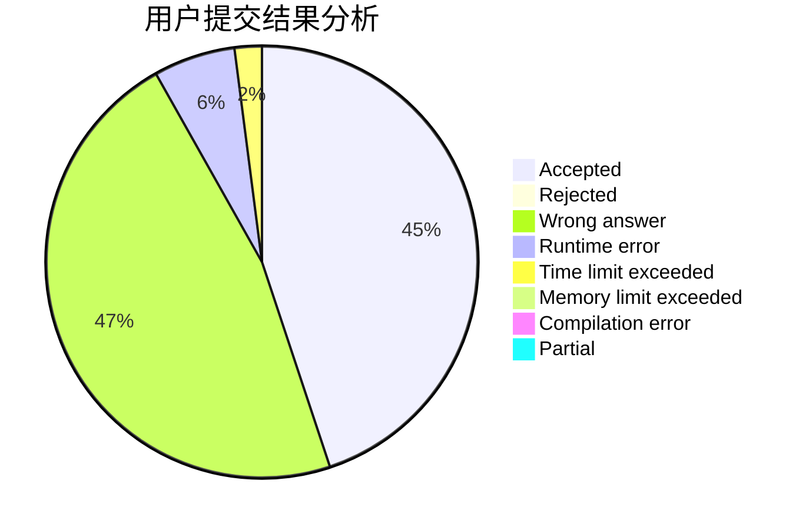
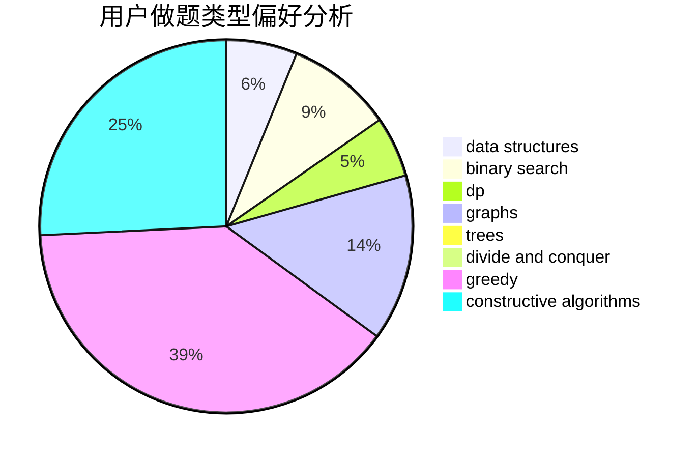
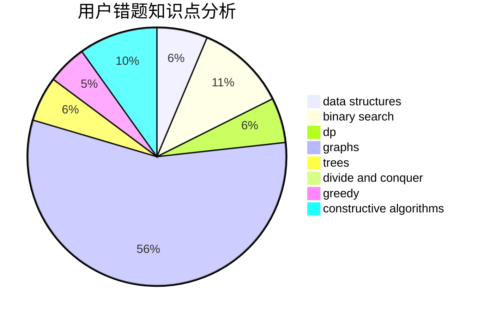

# yanjunjie

<!-- tabs:start -->

#### **用户提交结果分析**

#### **用户做题类型偏好分析**

#### **用户错题知识点分析**

<!-- tabs:end -->
# 推荐题目
[1352E](https://codeforces.com/contest/1352/problem/E)		brute force,
                        implementation,
                        two pointers		  
[772E](https://codeforces.com/contest/772/problem/E)		binary search,
                        divide and conquer,
                        interactive,
                        trees		  
[1110H](https://codeforces.com/contest/1110/problem/H)		dp,
                        strings		  
[898D](https://codeforces.com/contest/898/problem/D)		greedy		  
[1357C1](https://codeforces.com/contest/1357C/problem/1)		nan		  
[832B](https://codeforces.com/contest/832/problem/B)		implementation,
                        strings		  
[272D](https://codeforces.com/contest/272/problem/D)		combinatorics,
                        math,
                        sortings		  
[1102A](https://codeforces.com/contest/1102/problem/A)		math		  
[915D](https://codeforces.com/contest/915/problem/D)		dfs and similar,
                        graphs		  
[22C](https://codeforces.com/contest/22/problem/C)		graphs		  
