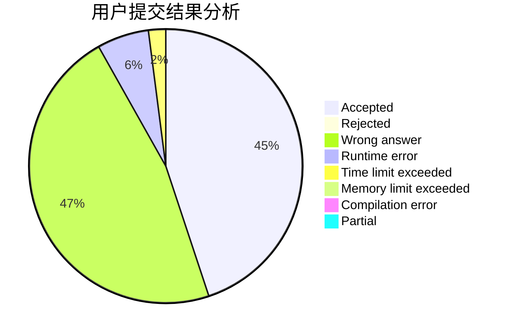
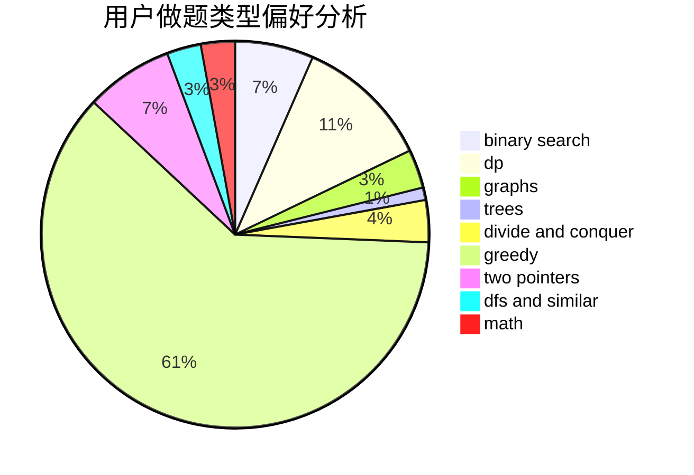

# yanjunjie

<!-- tabs:start -->

#### **用户提交结果分析**

#### **用户做题类型偏好分析**

<!-- tabs:end -->
# 推荐题目
[1359C](https://codeforces.com/contest/1359/problem/C)
[792C](https://codeforces.com/contest/792/problem/C)
[1111C](https://codeforces.com/contest/1111/problem/C)
[914F](https://codeforces.com/contest/914/problem/F)
[1365A](https://codeforces.com/contest/1365/problem/A)
[850D](https://codeforces.com/contest/850/problem/D)
[288D](https://codeforces.com/contest/288/problem/D)
[1102D](https://codeforces.com/contest/1102/problem/D)
[935C](https://codeforces.com/contest/935/problem/C)
[251A](https://codeforces.com/contest/251/problem/A)
