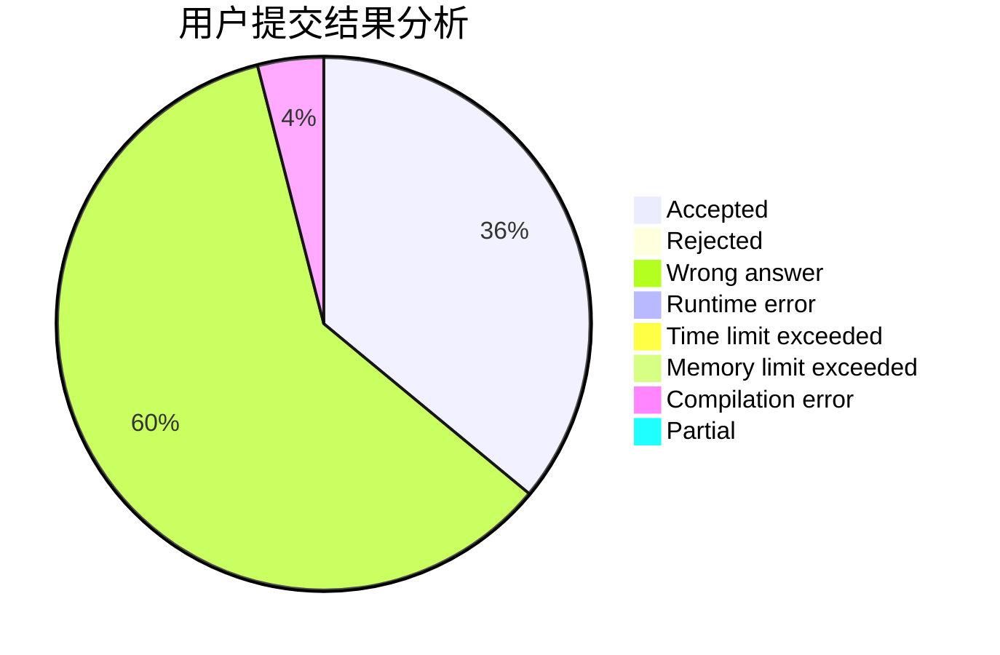
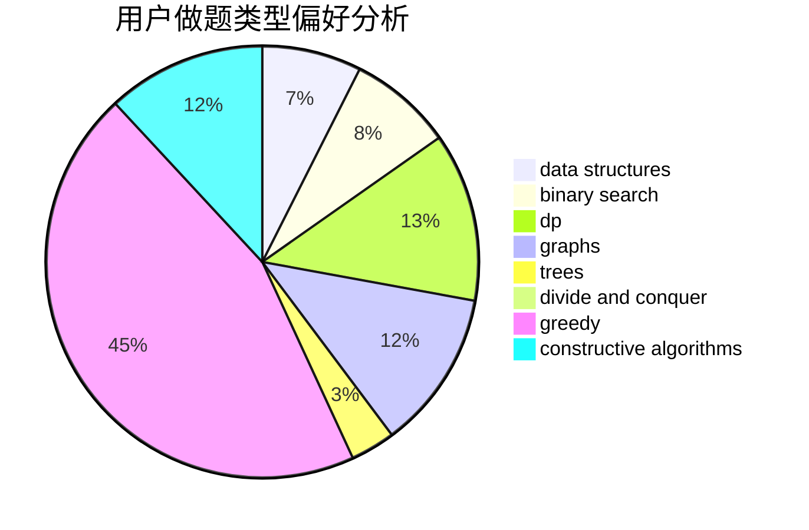
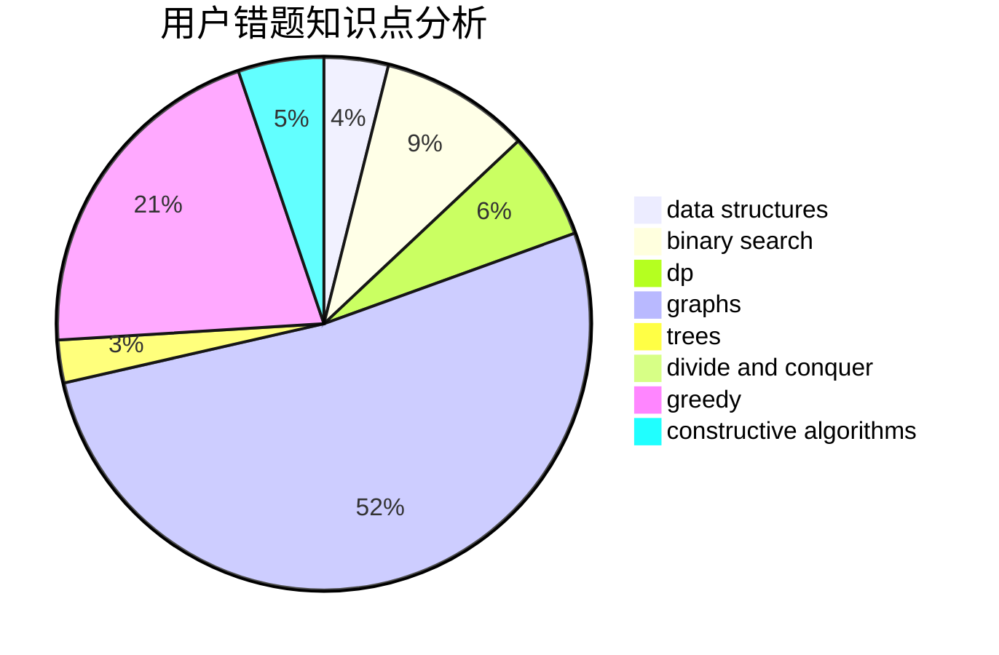

# yaoxi

<!-- tabs:start -->

#### **用户提交结果分析**

#### **用户做题类型偏好分析**

#### **用户错题知识点分析**

<!-- tabs:end -->
# 推荐题目
[464C](https://codeforces.com/contest/464/problem/C)		dp		  
[1031D](https://codeforces.com/contest/1031/problem/D)		greedy		  
[856F](https://codeforces.com/contest/856/problem/F)		greedy		  
[329B](https://codeforces.com/contest/329/problem/B)		dfs and similar,
                        shortest paths		  
[628F](https://codeforces.com/contest/628/problem/F)		flows		  
[909C](https://codeforces.com/contest/909/problem/C)		dp		  
[811C](https://codeforces.com/contest/811/problem/C)		dp,
                        implementation		  
[605A](https://codeforces.com/contest/605/problem/A)		constructive algorithms,
                        greedy		  
[1139C](https://codeforces.com/contest/1139/problem/C)		dfs and similar,
                        dsu,
                        graphs,
                        math,
                        trees		  
[920A](https://codeforces.com/contest/920/problem/A)		implementation		  
