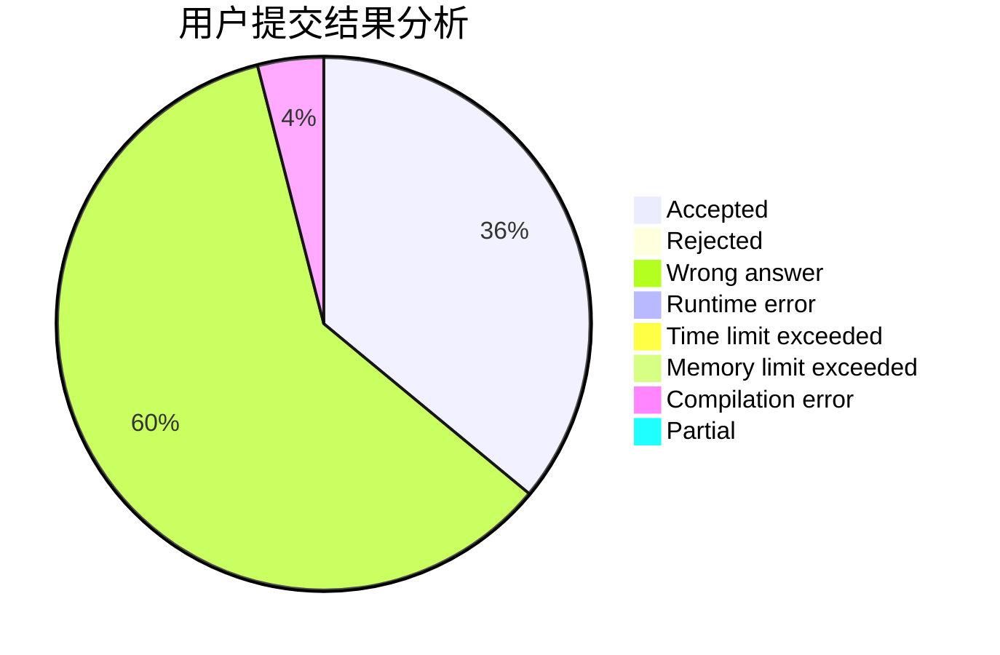
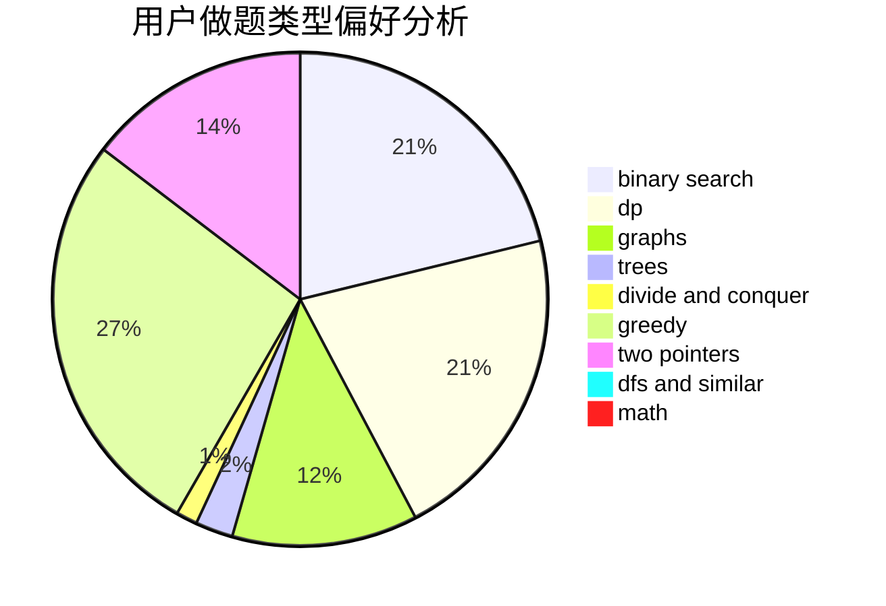

# yaoxi

<!-- tabs:start -->

#### **用户提交结果分析**

#### **用户做题类型偏好分析**

<!-- tabs:end -->
# 推荐题目
[484B](https://codeforces.com/contest/484/problem/B)
[1032F](https://codeforces.com/contest/1032/problem/F)
[875F](https://codeforces.com/contest/875/problem/F)
[356E](https://codeforces.com/contest/356/problem/E)
[656F](https://codeforces.com/contest/656/problem/F)
[924A](https://codeforces.com/contest/924/problem/A)
[830A](https://codeforces.com/contest/830/problem/A)
[623A](https://codeforces.com/contest/623/problem/A)
[1140G](https://codeforces.com/contest/1140/problem/G)
[940A](https://codeforces.com/contest/940/problem/A)
