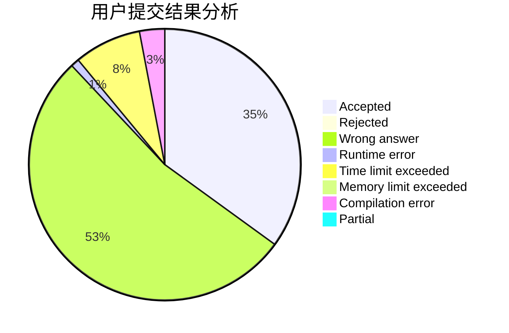
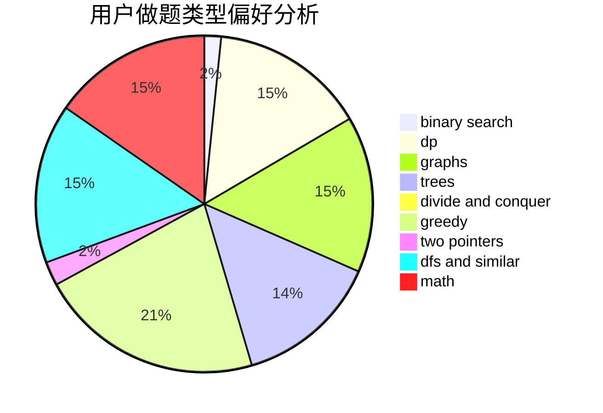

# yaren

<!-- tabs:start -->

#### **用户提交结果分析**

#### **用户做题类型偏好分析**

<!-- tabs:end -->
# 推荐题目
[453B](https://codeforces.com/contest/453/problem/B)
[1349E](https://codeforces.com/contest/1349/problem/E)
[883D](https://codeforces.com/contest/883/problem/D)
[914H](https://codeforces.com/contest/914/problem/H)
[160D](https://codeforces.com/contest/160/problem/D)
[901A](https://codeforces.com/contest/901/problem/A)
[849B](https://codeforces.com/contest/849/problem/B)
[1211B](https://codeforces.com/contest/1211/problem/B)
[176D](https://codeforces.com/contest/176/problem/D)
[1261C](https://codeforces.com/contest/1261/problem/C)
