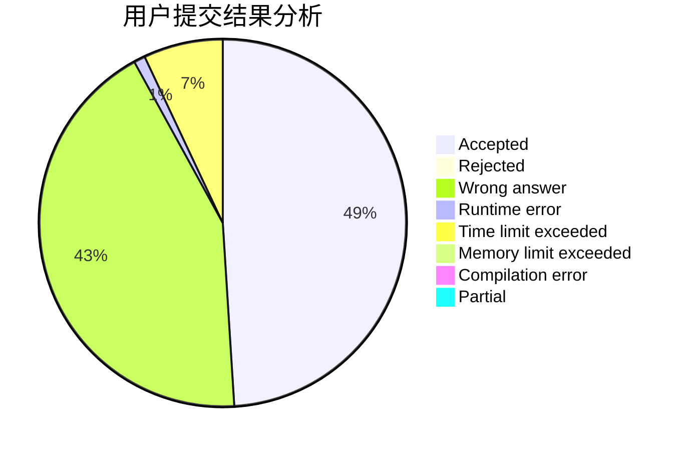
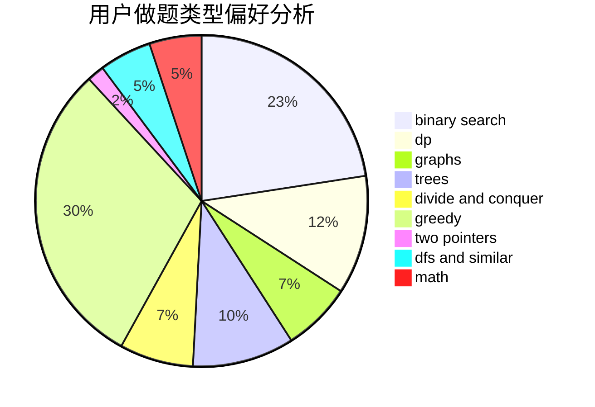

# Changyu

<!-- tabs:start -->

#### **用户提交结果分析**

#### **用户做题类型偏好分析**

<!-- tabs:end -->
# 推荐题目
[1409A](https://codeforces.com/contest/1409/problem/A)
[1342C](https://codeforces.com/contest/1342/problem/C)
[685C](https://codeforces.com/contest/685/problem/C)
[1106D](https://codeforces.com/contest/1106/problem/D)
[1147A](https://codeforces.com/contest/1147/problem/A)
[686C](https://codeforces.com/contest/686/problem/C)
[472C](https://codeforces.com/contest/472/problem/C)
[1463E](https://codeforces.com/contest/1463/problem/E)
[639D](https://codeforces.com/contest/639/problem/D)
[303C](https://codeforces.com/contest/303/problem/C)
