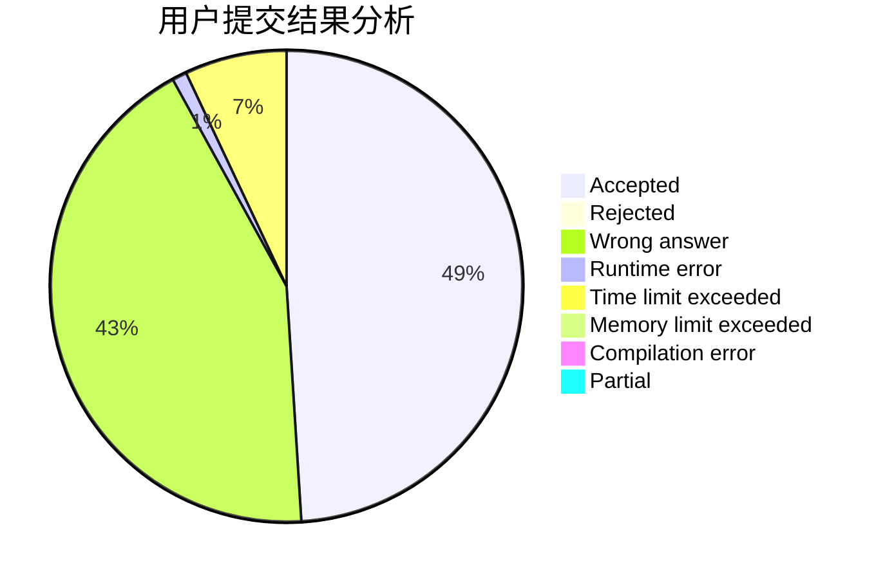
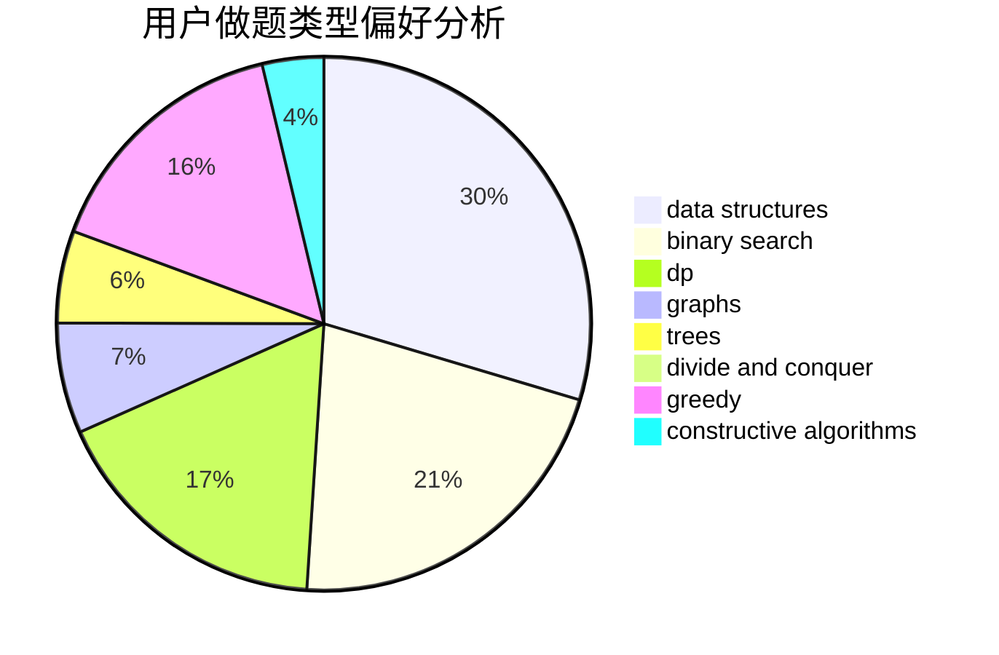
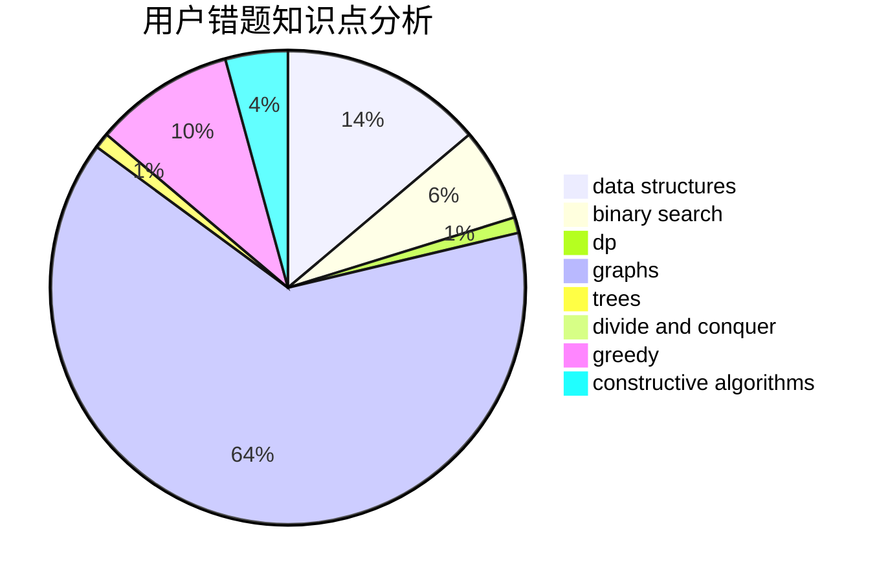

# Changyu

<!-- tabs:start -->

#### **用户提交结果分析**

#### **用户做题类型偏好分析**

#### **用户错题知识点分析**

<!-- tabs:end -->
# 推荐题目
[13A](https://codeforces.com/contest/13/problem/A)		implementation,
                        math		  
[1335C](https://codeforces.com/contest/1335/problem/C)		binary search,
                        greedy,
                        implementation,
                        sortings		  
[665B](https://codeforces.com/contest/665/problem/B)		brute force		  
[1106A](https://codeforces.com/contest/1106/problem/A)		implementation		  
[1144G](https://codeforces.com/contest/1144/problem/G)		dp,
                        greedy		  
[665E](https://codeforces.com/contest/665/problem/E)		data structures,
                        divide and conquer,
                        strings,
                        trees		  
[450B](https://codeforces.com/contest/450/problem/B)		implementation,
                        math		  
[1454B](https://codeforces.com/contest/1454/problem/B)		implementation		  
[618E](https://codeforces.com/contest/618/problem/E)		data structures,
                        geometry		  
[289D](https://codeforces.com/contest/289/problem/D)		dsu,graphs,sortings,trees		  
