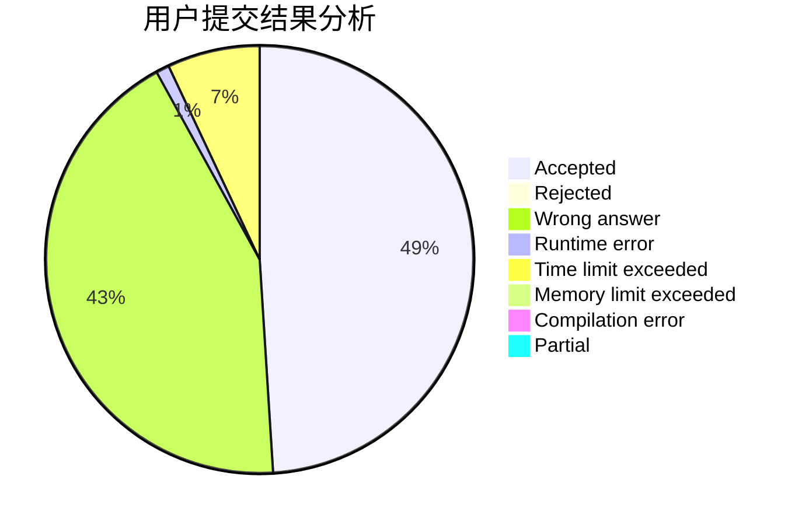
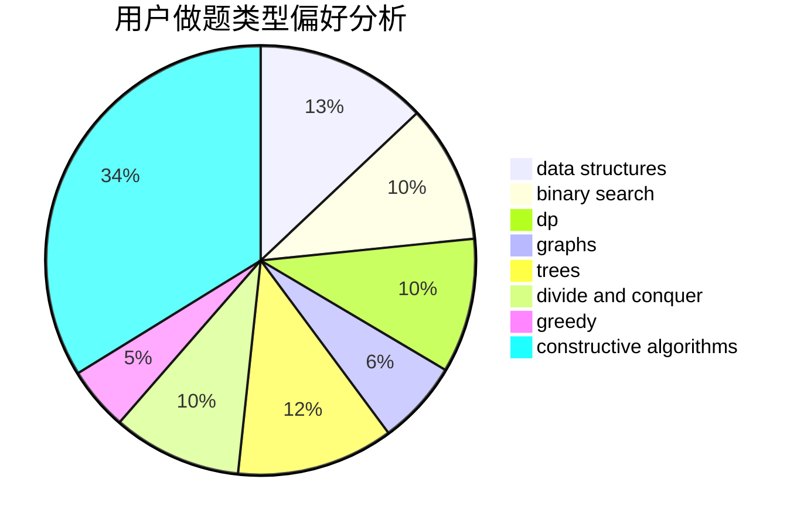
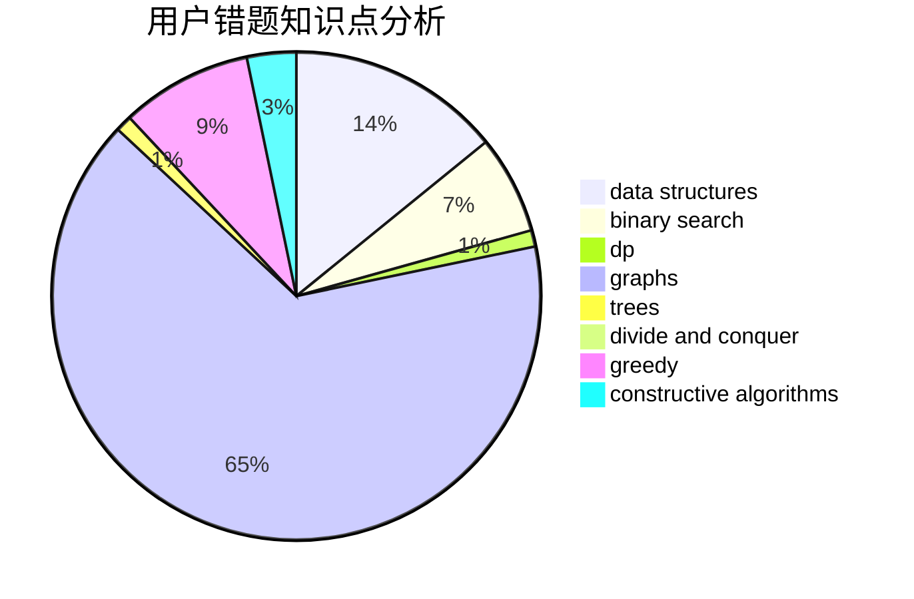

# Changyu

<!-- tabs:start -->

#### **用户提交结果分析**

#### **用户做题类型偏好分析**

#### **用户错题知识点分析**

<!-- tabs:end -->
# 推荐题目
[1409A](https://codeforces.com/contest/1409/problem/A)		greedy,
                        math		  
[1342C](https://codeforces.com/contest/1342/problem/C)		math,
                        number theory		  
[685C](https://codeforces.com/contest/685/problem/C)		binary search,
                        math		  
[1106D](https://codeforces.com/contest/1106/problem/D)		data structures,
                        dfs and similar,
                        graphs,
                        greedy,
                        shortest paths		  
[1147A](https://codeforces.com/contest/1147/problem/A)		graphs		  
[686C](https://codeforces.com/contest/686/problem/C)		dsu,graphs,sortings,trees		  
[472C](https://codeforces.com/contest/472/problem/C)		greedy		  
[1463E](https://codeforces.com/contest/1463/problem/E)		constructive algorithms,
                        dfs and similar,
                        dsu,
                        graphs,
                        implementation,
                        sortings,
                        trees		  
[639D](https://codeforces.com/contest/639/problem/D)		data structures,
                        greedy,
                        sortings,
                        two pointers		  
[303C](https://codeforces.com/contest/303/problem/C)		brute force,
                        graphs,
                        math,
                        number theory		  
