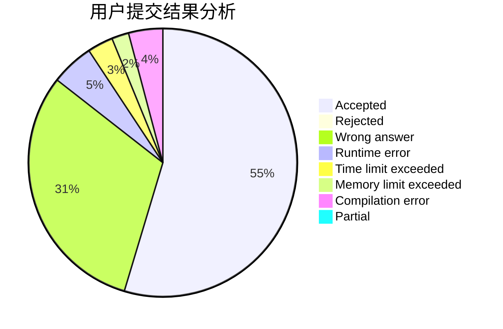
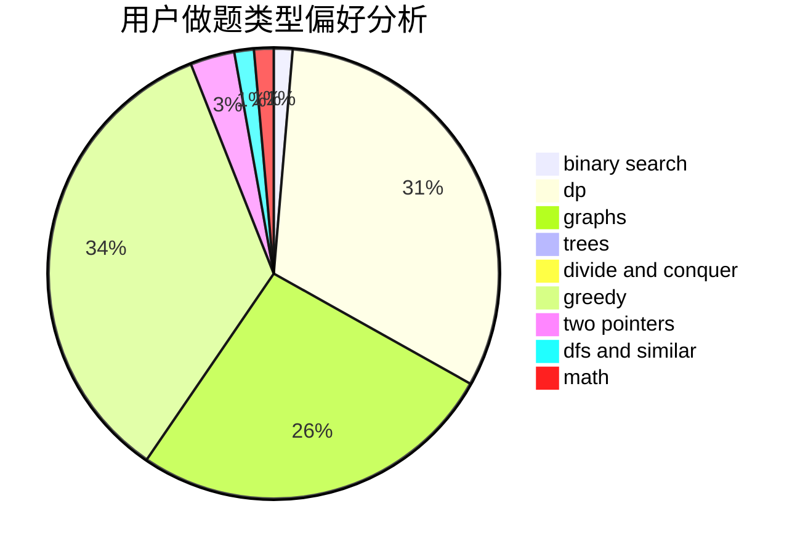

# ybw051114

<!-- tabs:start -->

#### **用户提交结果分析**

#### **用户做题类型偏好分析**

<!-- tabs:end -->
# 推荐题目
[600F](https://codeforces.com/contest/600/problem/F)
[67A](https://codeforces.com/contest/67/problem/A)
[813F](https://codeforces.com/contest/813/problem/F)
[957E](https://codeforces.com/contest/957/problem/E)
[1057B](https://codeforces.com/contest/1057/problem/B)
[600C](https://codeforces.com/contest/600/problem/C)
[1509F](https://codeforces.com/contest/1509/problem/F)
[1288E](https://codeforces.com/contest/1288/problem/E)
[868A](https://codeforces.com/contest/868/problem/A)
[283B](https://codeforces.com/contest/283/problem/B)
