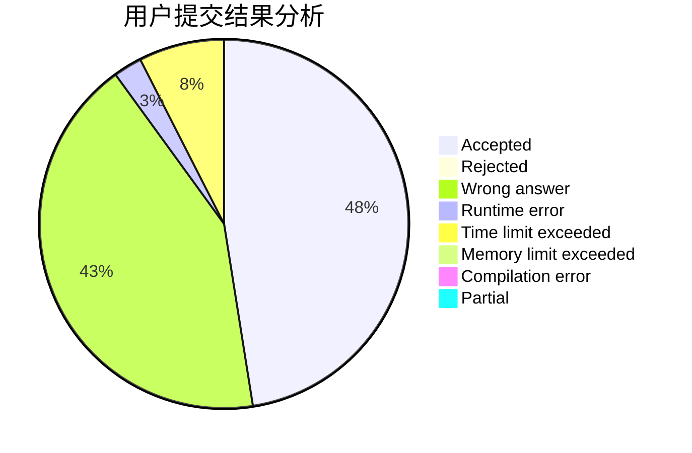
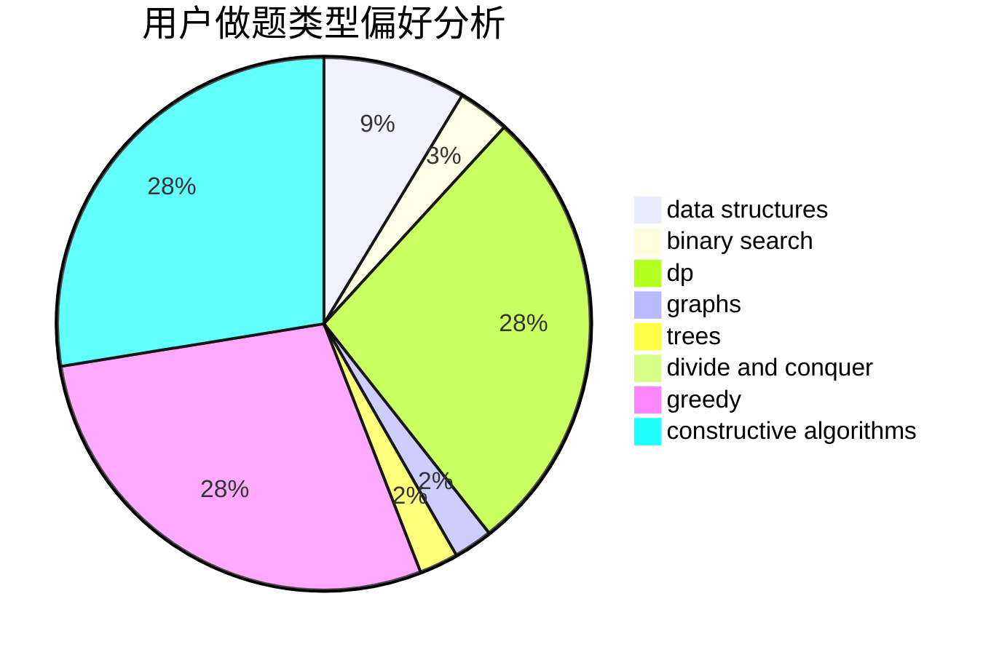
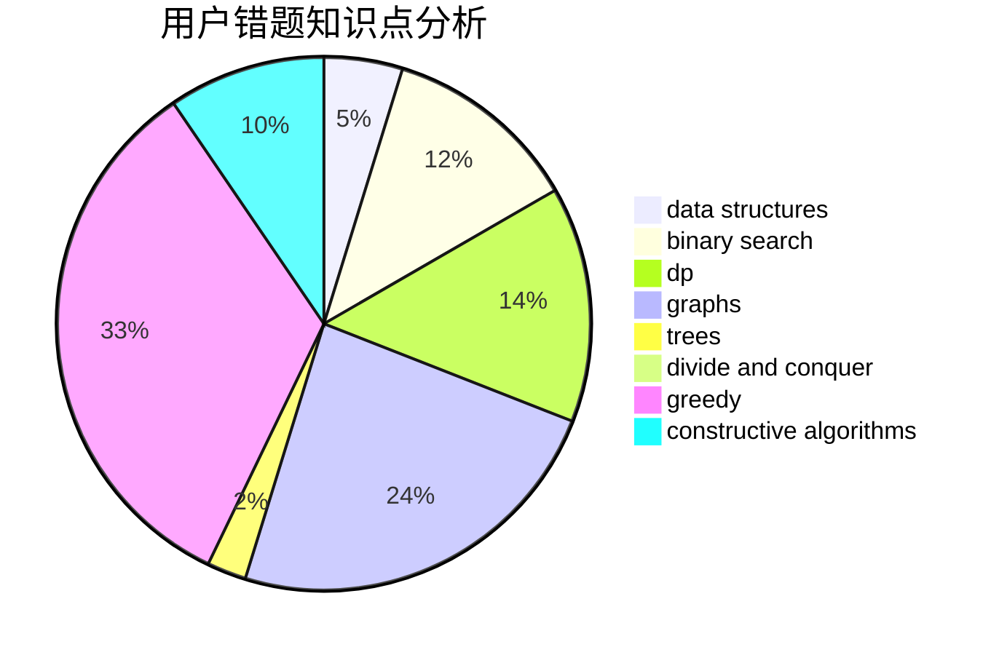

# ybw_2005

<!-- tabs:start -->

#### **用户提交结果分析**

#### **用户做题类型偏好分析**

#### **用户错题知识点分析**

<!-- tabs:end -->
# 推荐题目
[12471](https://codeforces.com/contest/1247/problem/1)		dsu,graphs,sortings,trees		  
[1461F](https://codeforces.com/contest/1461/problem/F)		constructive algorithms,
                        dp,
                        greedy		  
[742C](https://codeforces.com/contest/742/problem/C)		dsu,graphs,sortings,trees		  
[870A](https://codeforces.com/contest/870/problem/A)		brute force,
                        implementation		  
[120H](https://codeforces.com/contest/120/problem/H)		graph matchings		  
[1016E](https://codeforces.com/contest/1016/problem/E)		binary search,
                        geometry		  
[13932](https://codeforces.com/contest/1393/problem/2)		dsu,graphs,sortings,trees		  
[570E](https://codeforces.com/contest/570/problem/E)		combinatorics,
                        dp		  
[591D](https://codeforces.com/contest/591/problem/D)		dsu,graphs,sortings,trees		  
[1109B](https://codeforces.com/contest/1109/problem/B)		constructive algorithms,
                        hashing,
                        strings		  
