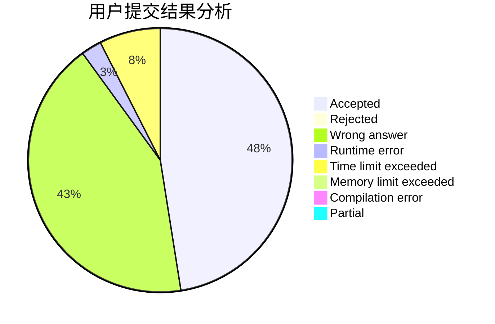
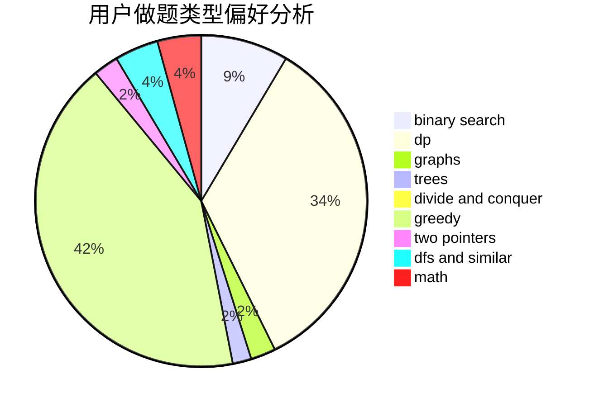

# ybw_2005

<!-- tabs:start -->

#### **用户提交结果分析**

#### **用户做题类型偏好分析**

<!-- tabs:end -->
# 推荐题目
[12471](https://codeforces.com/contest/1247/problem/1)
[1461F](https://codeforces.com/contest/1461/problem/F)
[742C](https://codeforces.com/contest/742/problem/C)
[870A](https://codeforces.com/contest/870/problem/A)
[120H](https://codeforces.com/contest/120/problem/H)
[1016E](https://codeforces.com/contest/1016/problem/E)
[13932](https://codeforces.com/contest/1393/problem/2)
[570E](https://codeforces.com/contest/570/problem/E)
[591D](https://codeforces.com/contest/591/problem/D)
[1109B](https://codeforces.com/contest/1109/problem/B)
