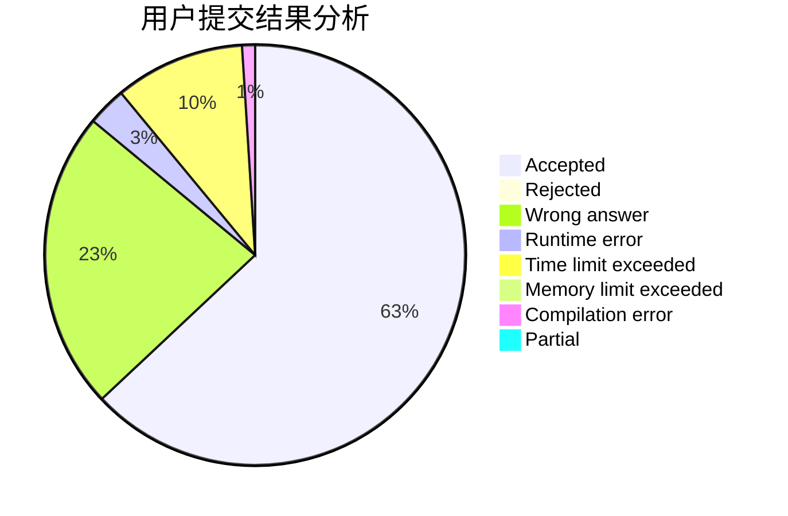
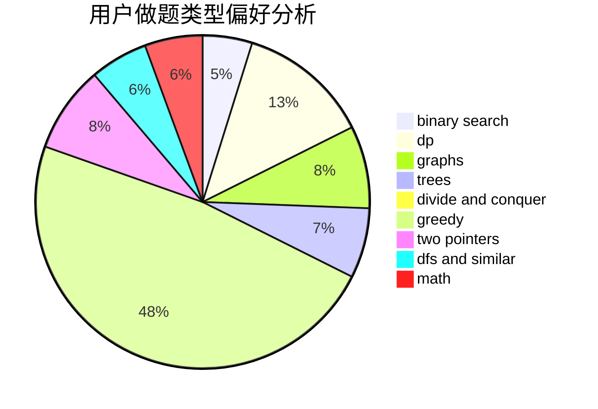

# ycdzj

<!-- tabs:start -->

#### **用户提交结果分析**

#### **用户做题类型偏好分析**

<!-- tabs:end -->
# 推荐题目
[1354A](https://codeforces.com/contest/1354/problem/A)
[893B](https://codeforces.com/contest/893/problem/B)
[295A](https://codeforces.com/contest/295/problem/A)
[1034E](https://codeforces.com/contest/1034/problem/E)
[11302](https://codeforces.com/contest/1130/problem/2)
[315A](https://codeforces.com/contest/315/problem/A)
[1000C](https://codeforces.com/contest/1000/problem/C)
[58C](https://codeforces.com/contest/58/problem/C)
[610A](https://codeforces.com/contest/610/problem/A)
[1104D](https://codeforces.com/contest/1104/problem/D)
