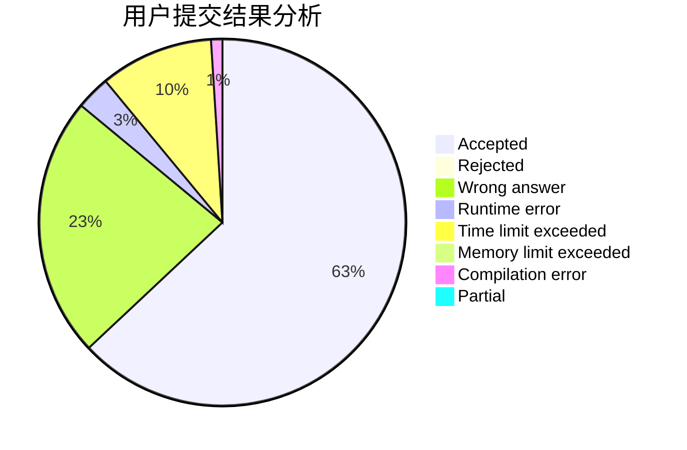
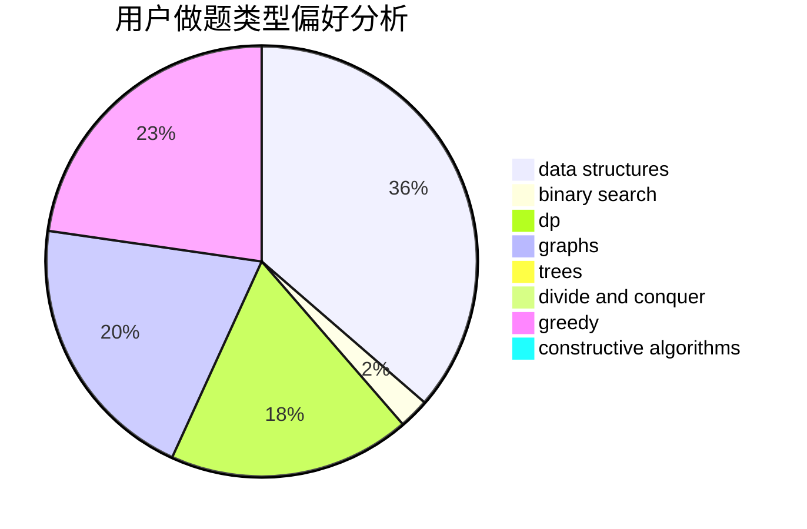
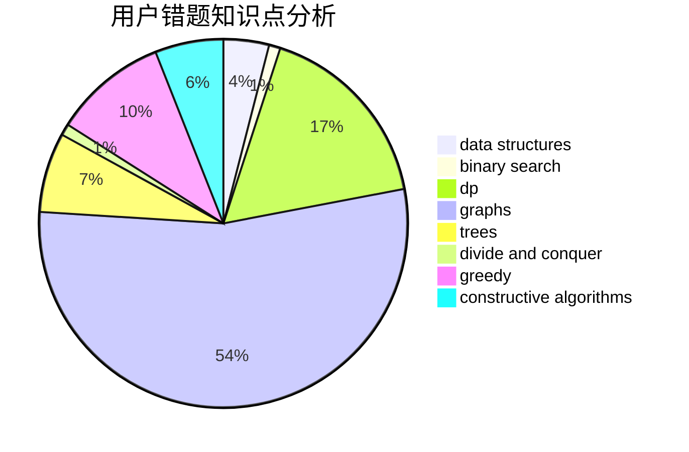

# ycdzj

<!-- tabs:start -->

#### **用户提交结果分析**

#### **用户做题类型偏好分析**

#### **用户错题知识点分析**

<!-- tabs:end -->
# 推荐题目
[1347B](https://codeforces.com/contest/1347/problem/B)		dsu,graphs,sortings,trees		  
[871E](https://codeforces.com/contest/871/problem/E)		graphs,
                        greedy,
                        trees		  
[27B](https://codeforces.com/contest/27/problem/B)		bitmasks,
                        brute force,
                        dfs and similar,
                        greedy		  
[1034B](https://codeforces.com/contest/1034/problem/B)		brute force,
                        constructive algorithms,
                        flows,
                        graph matchings		  
[1120F](https://codeforces.com/contest/1120/problem/F)		data structures,
                        dp,
                        greedy		  
[297E](https://codeforces.com/contest/297/problem/E)		data structures		  
[1000C](https://codeforces.com/contest/1000/problem/C)		data structures,
                        implementation,
                        sortings		  
[56A](https://codeforces.com/contest/56/problem/A)		implementation		  
[590C](https://codeforces.com/contest/590/problem/C)		dfs and similar,
                        graphs,
                        shortest paths		  
[1104A](https://codeforces.com/contest/1104/problem/A)		constructive algorithms,
                        implementation,
                        math		  
