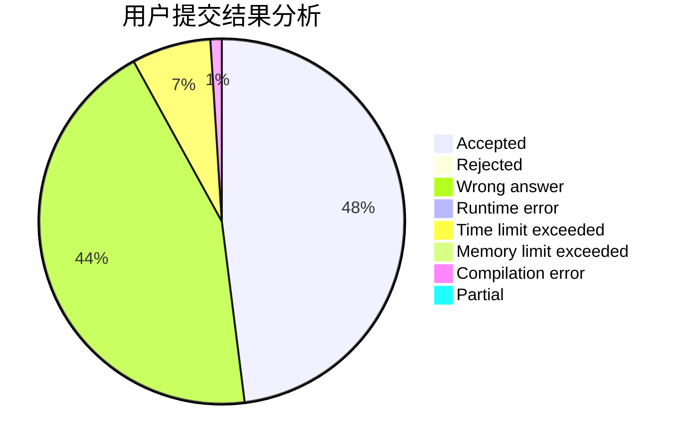
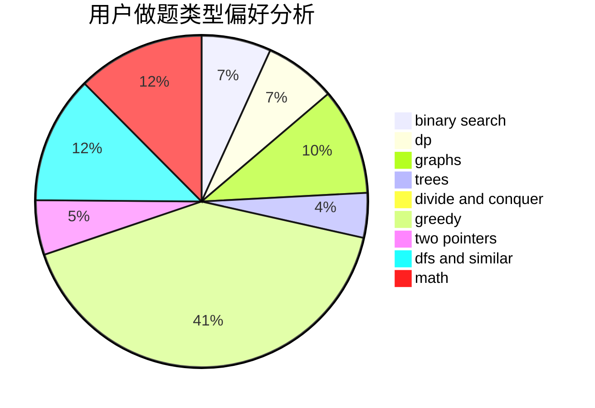

# ydh

<!-- tabs:start -->

#### **用户提交结果分析**

#### **用户做题类型偏好分析**

<!-- tabs:end -->
# 推荐题目
[1510C](https://codeforces.com/contest/1510/problem/C)
[896D](https://codeforces.com/contest/896/problem/D)
[1028D](https://codeforces.com/contest/1028/problem/D)
[396C](https://codeforces.com/contest/396/problem/C)
[585B](https://codeforces.com/contest/585/problem/B)
[603E](https://codeforces.com/contest/603/problem/E)
[1131A](https://codeforces.com/contest/1131/problem/A)
[1033E](https://codeforces.com/contest/1033/problem/E)
[405D](https://codeforces.com/contest/405/problem/D)
[319C](https://codeforces.com/contest/319/problem/C)
