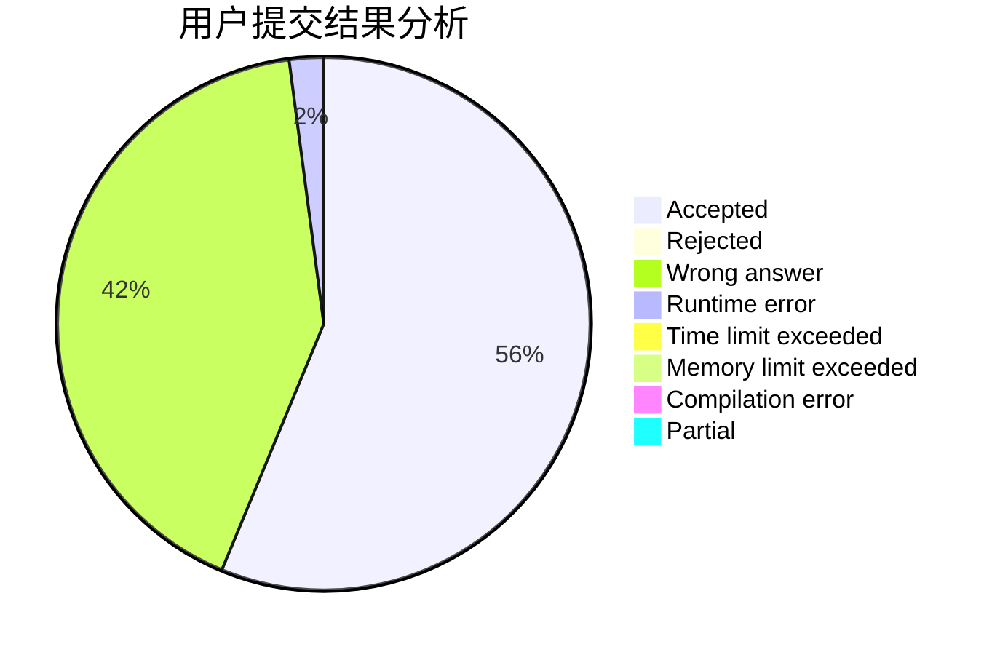
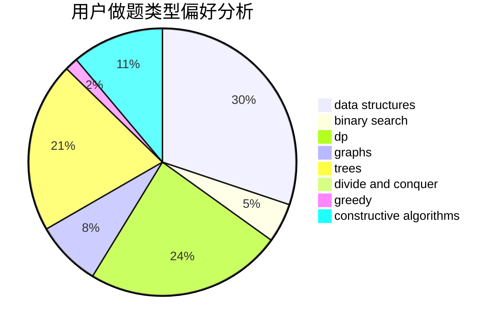
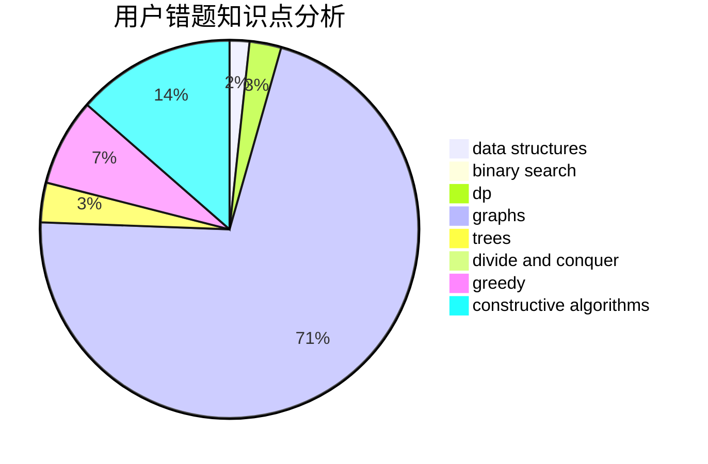

# ydhjuruo

<!-- tabs:start -->

#### **用户提交结果分析**

#### **用户做题类型偏好分析**

#### **用户错题知识点分析**

<!-- tabs:end -->
# 推荐题目
[1237F](https://codeforces.com/contest/1237/problem/F)		combinatorics,
                        dp		  
[182D](https://codeforces.com/contest/182/problem/D)		brute force,
                        hashing,
                        implementation,
                        math,
                        strings		  
[1040B](https://codeforces.com/contest/1040/problem/B)		dp,
                        greedy,
                        math		  
[14E](https://codeforces.com/contest/14/problem/E)		dp		  
[234C](https://codeforces.com/contest/234/problem/C)		dp,
                        implementation		  
[448D](https://codeforces.com/contest/448/problem/D)		binary search,
                        brute force		  
[509C](https://codeforces.com/contest/509/problem/C)		dp,
                        greedy,
                        implementation		  
[729C](https://codeforces.com/contest/729/problem/C)		binary search,
                        greedy,
                        sortings		  
[12642](https://codeforces.com/contest/1264/problem/2)		dsu,graphs,sortings,trees		  
[1110F](https://codeforces.com/contest/1110/problem/F)		data structures,
                        trees		  
