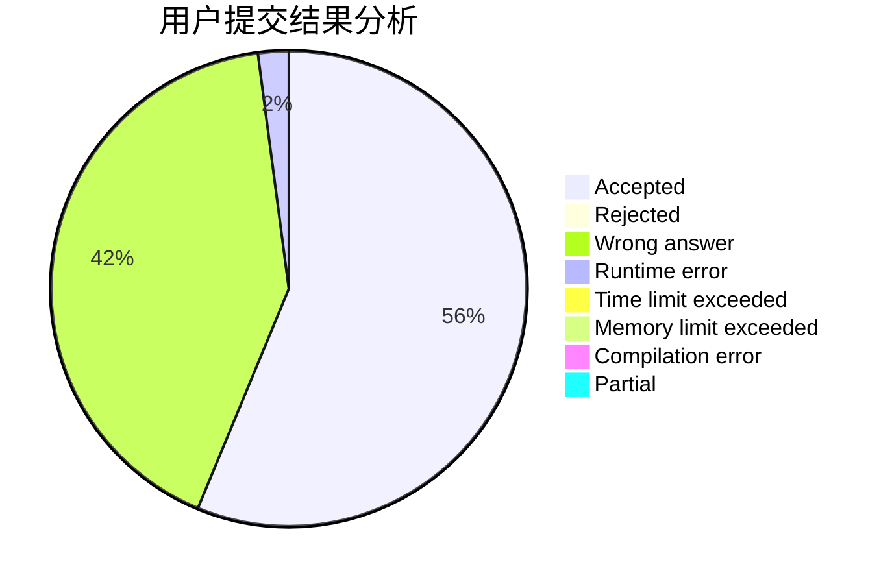
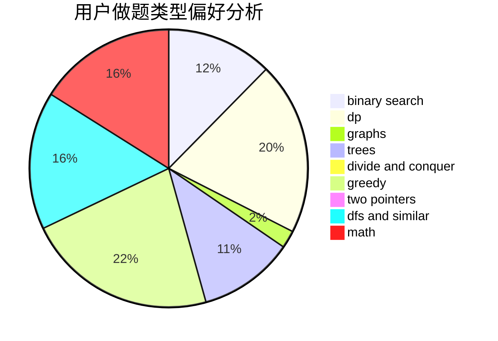

# ydhjuruo

<!-- tabs:start -->

#### **用户提交结果分析**

#### **用户做题类型偏好分析**

<!-- tabs:end -->
# 推荐题目
[1237F](https://codeforces.com/contest/1237/problem/F)
[182D](https://codeforces.com/contest/182/problem/D)
[1040B](https://codeforces.com/contest/1040/problem/B)
[14E](https://codeforces.com/contest/14/problem/E)
[234C](https://codeforces.com/contest/234/problem/C)
[448D](https://codeforces.com/contest/448/problem/D)
[509C](https://codeforces.com/contest/509/problem/C)
[729C](https://codeforces.com/contest/729/problem/C)
[12642](https://codeforces.com/contest/1264/problem/2)
[1110F](https://codeforces.com/contest/1110/problem/F)
