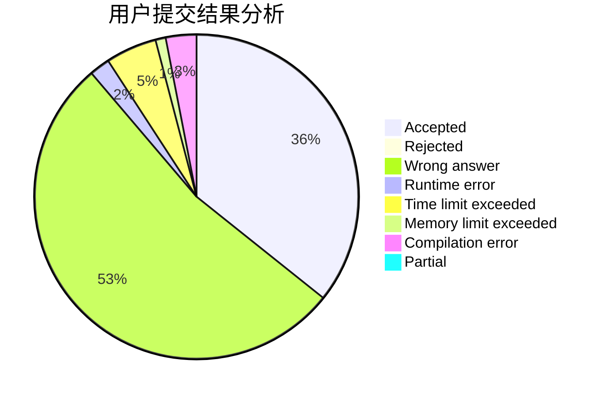
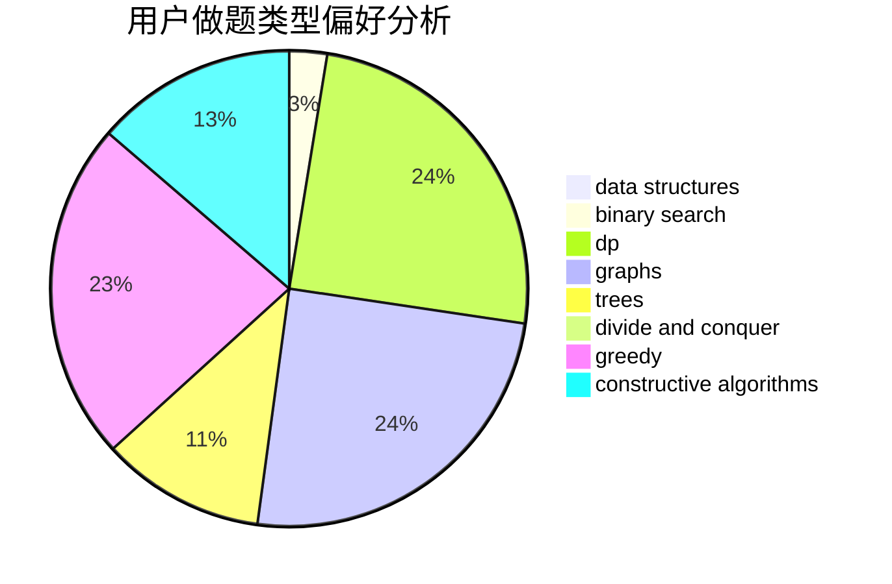
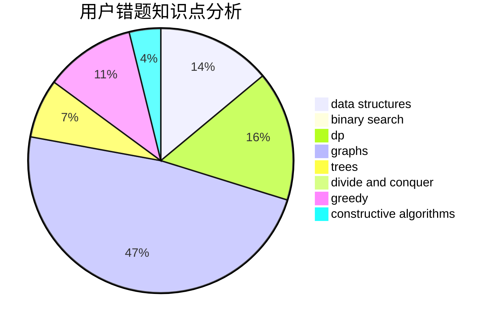

# ydnhaha

<!-- tabs:start -->

#### **用户提交结果分析**

#### **用户做题类型偏好分析**

#### **用户错题知识点分析**

<!-- tabs:end -->
# 推荐题目
[1358F](https://codeforces.com/contest/1358/problem/F)		binary search,
                        constructive algorithms,
                        greedy,
                        implementation		  
[1189C](https://codeforces.com/contest/1189/problem/C)		data structures,
                        dp,
                        implementation,
                        math		  
[1373F](https://codeforces.com/contest/1373/problem/F)		binary search,
                        constructive algorithms,
                        data structures,
                        greedy		  
[768D](https://codeforces.com/contest/768/problem/D)		dp,
                        math,
                        probabilities		  
[120H](https://codeforces.com/contest/120/problem/H)		graph matchings		  
[567E](https://codeforces.com/contest/567/problem/E)		dfs and similar,
                        graphs,
                        hashing,
                        shortest paths		  
[1307C](https://codeforces.com/contest/1307/problem/C)		brute force,
                        dp,
                        math,
                        strings		  
[670A](https://codeforces.com/contest/670/problem/A)		brute force,
                        constructive algorithms,
                        greedy,
                        math		  
[1151D](https://codeforces.com/contest/1151/problem/D)		greedy,
                        math,
                        sortings		  
[709D](https://codeforces.com/contest/709/problem/D)		dsu,graphs,sortings,trees		  
