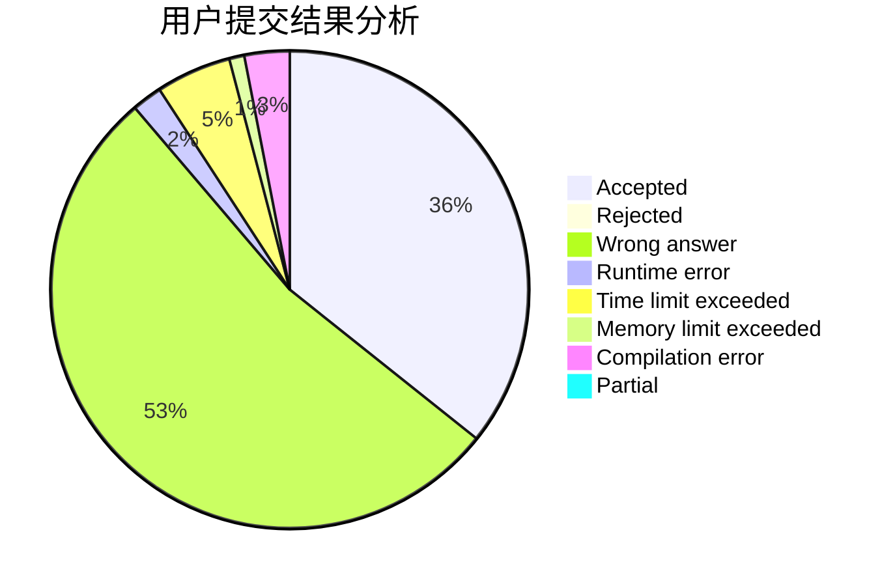
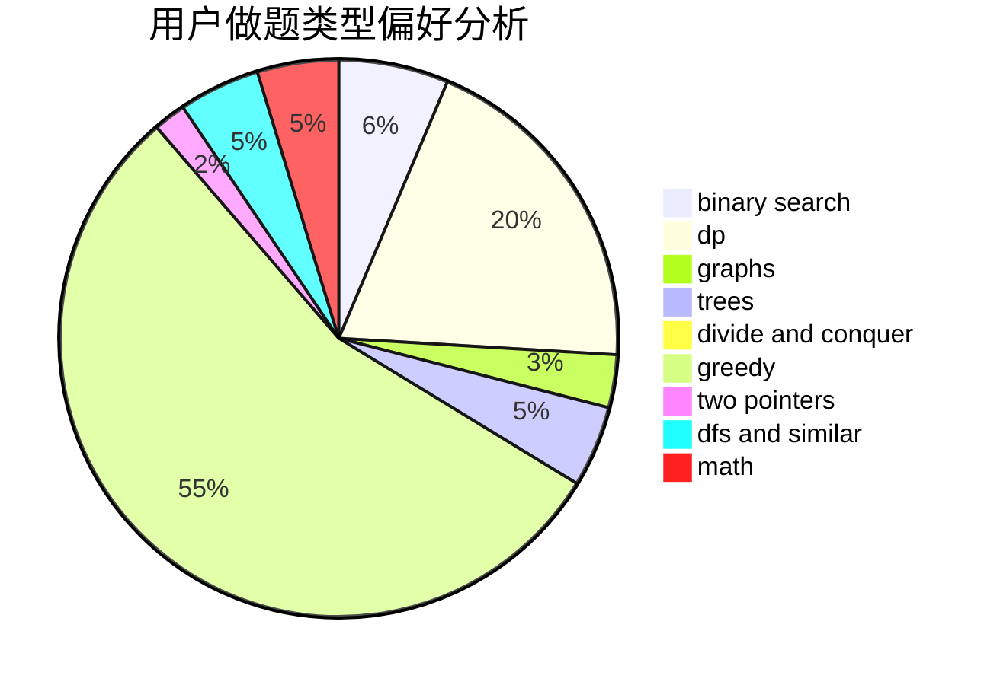

# ydnhaha

<!-- tabs:start -->

#### **用户提交结果分析**

#### **用户做题类型偏好分析**

<!-- tabs:end -->
# 推荐题目
[13671](https://codeforces.com/contest/1367/problem/1)
[1194E](https://codeforces.com/contest/1194/problem/E)
[1382B](https://codeforces.com/contest/1382/problem/B)
[788C](https://codeforces.com/contest/788/problem/C)
[12162](https://codeforces.com/contest/1216/problem/2)
[587D](https://codeforces.com/contest/587/problem/D)
[1315D](https://codeforces.com/contest/1315/problem/D)
[691E](https://codeforces.com/contest/691/problem/E)
[1153D](https://codeforces.com/contest/1153/problem/D)
[729E](https://codeforces.com/contest/729/problem/E)
