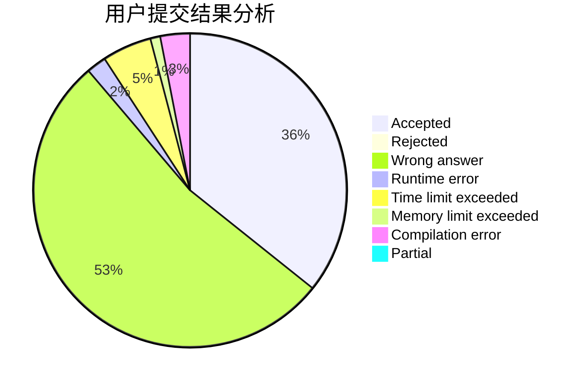
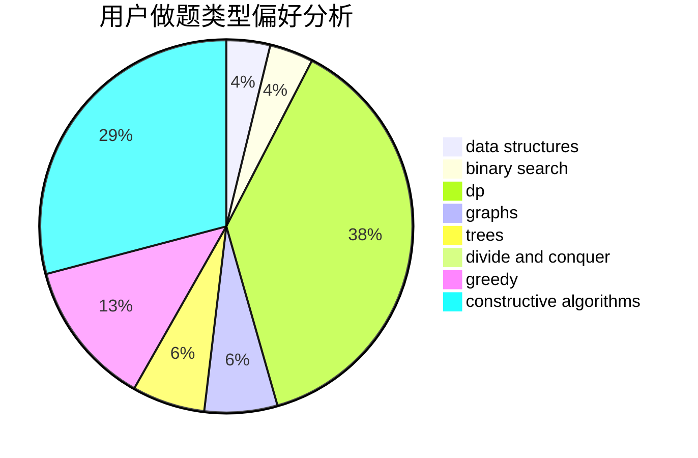
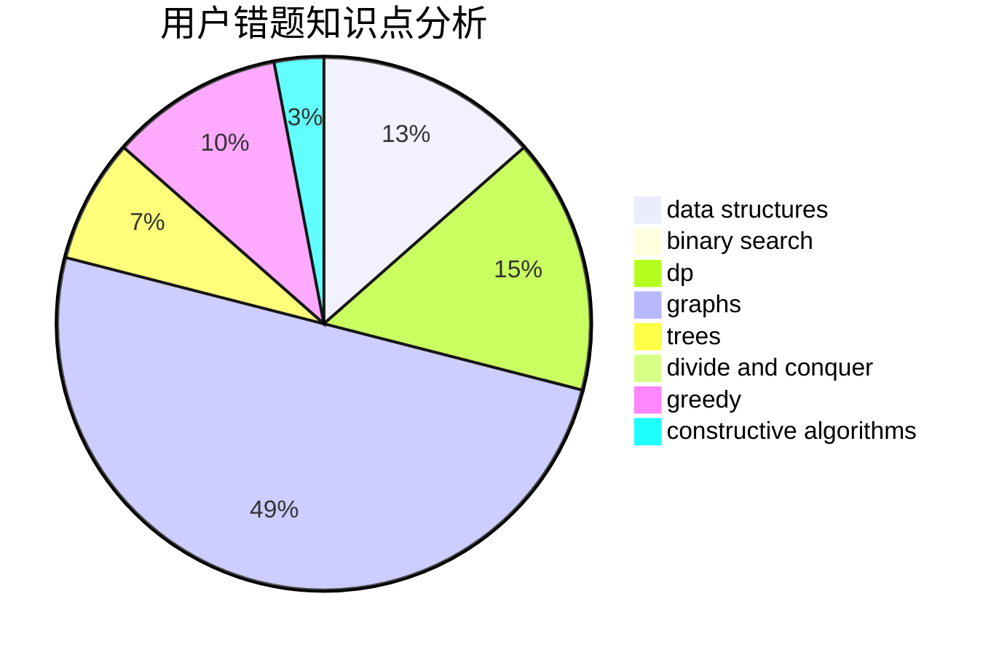

# ydnhaha

<!-- tabs:start -->

#### **用户提交结果分析**

#### **用户做题类型偏好分析**

#### **用户错题知识点分析**

<!-- tabs:end -->
# 推荐题目
[13671](https://codeforces.com/contest/1367/problem/1)		dsu,graphs,sortings,trees		  
[1194E](https://codeforces.com/contest/1194/problem/E)		bitmasks,
                        brute force,
                        data structures,
                        geometry,
                        sortings		  
[1382B](https://codeforces.com/contest/1382/problem/B)		dp,
                        games		  
[788C](https://codeforces.com/contest/788/problem/C)		dfs and similar,
                        graphs,
                        shortest paths		  
[12162](https://codeforces.com/contest/1216/problem/2)		dsu,graphs,sortings,trees		  
[587D](https://codeforces.com/contest/587/problem/D)		2-sat,
                        binary search		  
[1315D](https://codeforces.com/contest/1315/problem/D)		dsu,graphs,sortings,trees		  
[691E](https://codeforces.com/contest/691/problem/E)		matrices		  
[1153D](https://codeforces.com/contest/1153/problem/D)		binary search,
                        dfs and similar,
                        dp,
                        greedy,
                        trees		  
[729E](https://codeforces.com/contest/729/problem/E)		constructive algorithms,
                        data structures,
                        graphs,
                        greedy,
                        sortings		  
