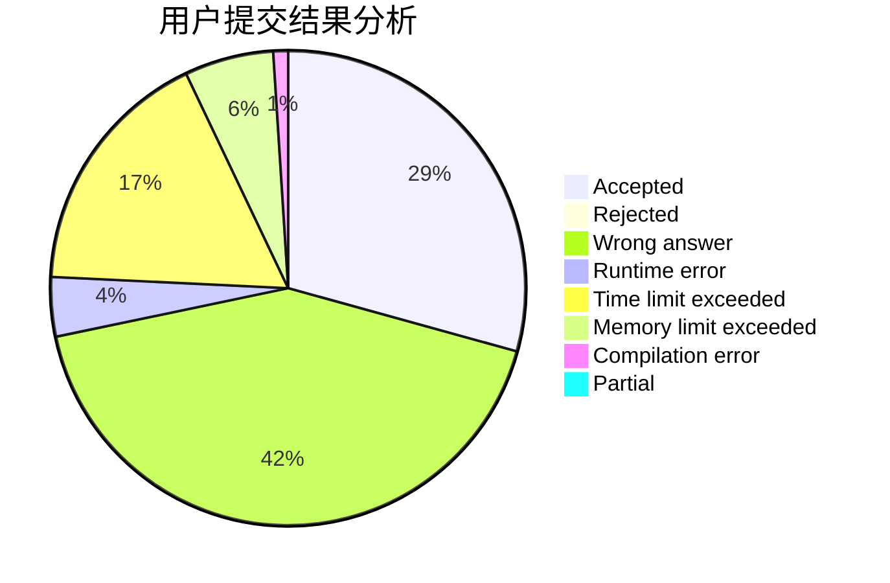
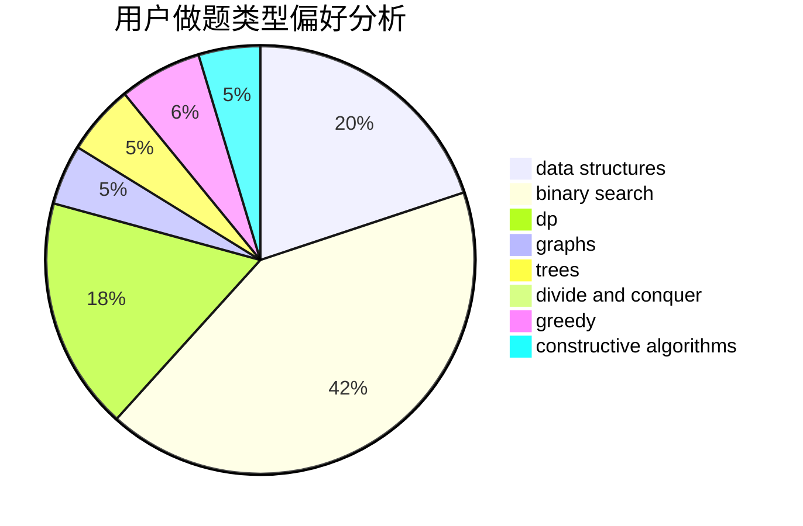
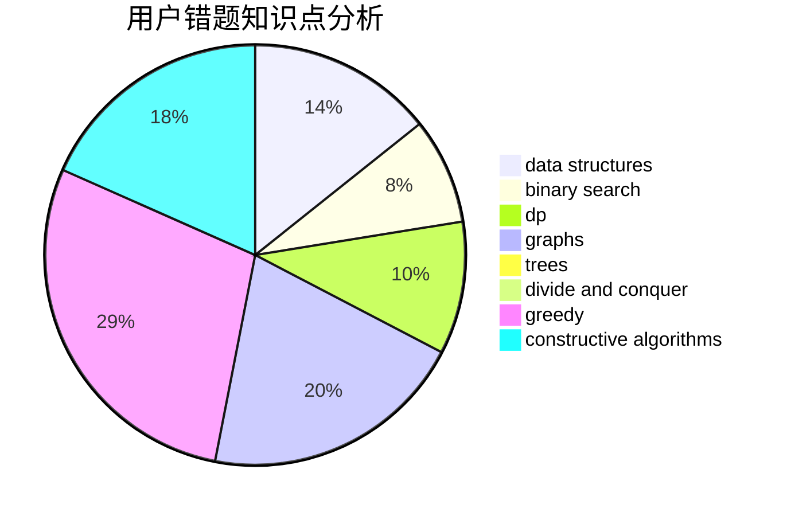

# yesky
<!-- tabs:start -->
#### **用户提交结果分析**

#### **用户做题类型偏好分析**

#### **用户错题知识点分析**

<!-- tabs:end -->
# 推荐题目
[Two Small Strings](http://codeforces.com/problemset/problem/1213/E)		brute force,
                        constructive algorithms		  
[Little Artem and Time Machine](https://codeforces.com/contest/668/problem/D)		data structures		  
[k-d-sequence](http://codeforces.com/problemset/problem/407/E)		data structures		  
[Beautiful fountains rows](http://codeforces.com/problemset/problem/799/F)		data structures		  
[Design Tutorial: Inverse the Problem](http://codeforces.com/problemset/problem/472/D)		dfs and similar,
                        dsu,
                        shortest paths,
                        trees		  
[Timofey and cubes](http://codeforces.com/problemset/problem/764/B)		constructive algorithms,
                        implementation		  
[Playing with Permutations](http://codeforces.com/problemset/problem/251/B)		implementation,
                        math		  
[Game](http://codeforces.com/problemset/problem/630/R)		games,
                        math		  
[Chess Strikes Back (hard version)](http://codeforces.com/problemset/problem/1379/F2)		data structures,
                        divide and conquer		  
[Mike and code of a permutation](http://codeforces.com/problemset/problem/798/E)		constructive algorithms,
                        data structures,
                        graphs,
                        sortings		  
<!-- tabs:start -->
#### **data structures**
[Two Small Strings](https://codeforces.com/contest/668/problem/D)		data structures		  
[Little Artem and Time Machine](http://codeforces.com/problemset/problem/407/E)		data structures		  
[k-d-sequence](http://codeforces.com/problemset/problem/799/F)		data structures		  
[Beautiful fountains rows](http://codeforces.com/problemset/problem/1379/F2)		data structures,
                        divide and conquer		  
[Design Tutorial: Inverse the Problem](http://codeforces.com/problemset/problem/798/E)		constructive algorithms,
                        data structures,
                        graphs,
                        sortings		  
[Timofey and cubes](http://codeforces.com/problemset/problem/173/E)		data structures,
                        sortings		  
[Playing with Permutations](https://codeforces.com/contest/831/problem/F)		brute force,
                        data structures,
                        implementation,
                        math,
                        number theory,
                        sortings,
                        two pointers		  
[Game](http://codeforces.com/problemset/problem/567/D)		binary search,
                        data structures,
                        greedy,
                        sortings		  
[Chess Strikes Back (hard version)](http://codeforces.com/problemset/problem/920/E)		data structures,
                        dfs and similar,
                        dsu,
                        graphs		  
[Mike and code of a permutation](http://codeforces.com/problemset/problem/1265/B)		data structures,
                        implementation,
                        math,
                        two pointers		  
#### **binary search**
[Two Small Strings](http://codeforces.com/problemset/problem/924/B)		binary search,
                        greedy,
                        two pointers		  
[Little Artem and Time Machine](http://codeforces.com/problemset/problem/567/D)		binary search,
                        data structures,
                        greedy,
                        sortings		  
[k-d-sequence](http://codeforces.com/problemset/problem/1492/C)		binary search,
                        data structures,
                        dp,
                        greedy,
                        two pointers		  
[Beautiful fountains rows](http://codeforces.com/problemset/problem/1463/D)		binary search,
                        constructive algorithms,
                        greedy,
                        two pointers		  
[Design Tutorial: Inverse the Problem](http://codeforces.com/problemset/problem/1490/G)		binary search,
                        data structures,
                        math		  
[Timofey and cubes](http://codeforces.com/problemset/problem/1479/D)		binary search,
                        bitmasks,
                        brute force,
                        data structures,
                        probabilities,
                        trees		  
[Playing with Permutations](http://codeforces.com/problemset/problem/1436/E)		binary search,
                        data structures,
                        two pointers		  
[Game](http://codeforces.com/problemset/problem/1461/D)		binary search,
                        brute force,
                        data structures,
                        divide and conquer,
                        implementation,
                        sortings		  
[Chess Strikes Back (hard version)](http://codeforces.com/problemset/problem/1493/C)		binary search,
                        brute force,
                        constructive algorithms,
                        greedy,
                        strings		  
[Mike and code of a permutation](http://codeforces.com/problemset/problem/1487/D)		binary search,
                        brute force,
                        math,
                        number theory		  
#### **dp**
[Two Small Strings](http://codeforces.com/problemset/problem/238/E)		dp,
                        graphs,
                        shortest paths		  
[Little Artem and Time Machine](http://codeforces.com/problemset/problem/703/E)		dp,
                        number theory		  
[k-d-sequence](http://codeforces.com/problemset/problem/773/F)		combinatorics,
                        divide and conquer,
                        dp,
                        fft,
                        math,
                        number theory		  
[Beautiful fountains rows](http://codeforces.com/problemset/problem/1176/F)		dp,
                        implementation,
                        sortings		  
[Design Tutorial: Inverse the Problem](http://codeforces.com/problemset/problem/590/D)		dp		  
[Timofey and cubes](http://codeforces.com/problemset/problem/1383/B)		bitmasks,
                        constructive algorithms,
                        dp,
                        games,
                        greedy,
                        math		  
[Playing with Permutations](http://codeforces.com/problemset/problem/1430/F)		dp,
                        greedy		  
[Game](http://codeforces.com/problemset/problem/747/D)		dp,
                        greedy,
                        sortings		  
[Chess Strikes Back (hard version)](https://codeforces.com/contest/764/problem/C)		dfs and similar,
                        dp,
                        dsu,
                        graphs,
                        implementation,
                        trees		  
[Mike and code of a permutation](http://codeforces.com/problemset/problem/1097/G)		combinatorics,
                        dp,
                        trees		  
#### **graph**
[Two Small Strings](http://codeforces.com/problemset/problem/798/E)		constructive algorithms,
                        data structures,
                        graphs,
                        sortings		  
[Little Artem and Time Machine](http://codeforces.com/problemset/problem/238/E)		dp,
                        graphs,
                        shortest paths		  
[k-d-sequence](http://codeforces.com/problemset/problem/689/B)		dfs and similar,
                        graphs,
                        greedy,
                        shortest paths		  
[Beautiful fountains rows](http://codeforces.com/problemset/problem/1082/D)		constructive algorithms,
                        graphs,
                        implementation		  
[Design Tutorial: Inverse the Problem](http://codeforces.com/problemset/problem/920/E)		data structures,
                        dfs and similar,
                        dsu,
                        graphs		  
[Timofey and cubes](http://codeforces.com/problemset/problem/103/E)		flows,
                        graph matchings		  
[Playing with Permutations](https://codeforces.com/contest/764/problem/C)		dfs and similar,
                        dp,
                        dsu,
                        graphs,
                        implementation,
                        trees		  
[Game](http://codeforces.com/problemset/problem/711/D)		combinatorics,
                        dfs and similar,
                        graphs,
                        math		  
[Chess Strikes Back (hard version)](http://codeforces.com/problemset/problem/1250/E)		graphs,
                        implementation		  
[Mike and code of a permutation](http://codeforces.com/problemset/problem/1487/C)		brute force,
                        constructive algorithms,
                        dfs and similar,
                        graphs,
                        greedy,
                        implementation,
                        math		  
#### **trees**
[Two Small Strings](http://codeforces.com/problemset/problem/472/D)		dfs and similar,
                        dsu,
                        shortest paths,
                        trees		  
[Little Artem and Time Machine](https://codeforces.com/contest/764/problem/C)		dfs and similar,
                        dp,
                        dsu,
                        graphs,
                        implementation,
                        trees		  
[k-d-sequence](http://codeforces.com/problemset/problem/1097/G)		combinatorics,
                        dp,
                        trees		  
[Beautiful fountains rows](http://codeforces.com/problemset/problem/1479/D)		binary search,
                        bitmasks,
                        brute force,
                        data structures,
                        probabilities,
                        trees		  
[Design Tutorial: Inverse the Problem](http://codeforces.com/problemset/problem/1511/C)		brute force,
                        data structures,
                        implementation,
                        trees		  
[Timofey and cubes](http://codeforces.com/problemset/problem/1499/F)		combinatorics,
                        dfs and similar,
                        dp,
                        trees		  
[Playing with Permutations](http://codeforces.com/problemset/problem/1491/E)		brute force,
                        dfs and similar,
                        divide and conquer,
                        number theory,
                        trees		  
[Game](http://codeforces.com/problemset/problem/1466/D)		data structures,
                        greedy,
                        sortings,
                        trees		  
[Chess Strikes Back (hard version)](http://codeforces.com/problemset/problem/1495/D)		combinatorics,
                        dfs and similar,
                        graphs,
                        math,
                        shortest paths,
                        trees		  
[Mike and code of a permutation](http://codeforces.com/problemset/problem/1303/G)		data structures,
                        divide and conquer,
                        geometry,
                        trees		  
#### **divide and conquer**
[Two Small Strings](http://codeforces.com/problemset/problem/1379/F2)		data structures,
                        divide and conquer		  
[Little Artem and Time Machine](http://codeforces.com/problemset/problem/773/F)		combinatorics,
                        divide and conquer,
                        dp,
                        fft,
                        math,
                        number theory		  
[k-d-sequence](http://codeforces.com/problemset/problem/1261/F)		bitmasks,
                        divide and conquer,
                        math		  
[Beautiful fountains rows](http://codeforces.com/problemset/problem/1461/D)		binary search,
                        brute force,
                        data structures,
                        divide and conquer,
                        implementation,
                        sortings		  
[Design Tutorial: Inverse the Problem](http://codeforces.com/problemset/problem/1466/G)		combinatorics,
                        divide and conquer,
                        hashing,
                        math,
                        string suffix structures,
                        strings		  
[Timofey and cubes](http://codeforces.com/problemset/problem/1490/D)		dfs and similar,
                        divide and conquer,
                        implementation		  
[Playing with Permutations](https://codeforces.com/contest/1483/problem/C)		data structures,
                        divide and conquer,
                        dp		  
[Game](http://codeforces.com/problemset/problem/1491/E)		brute force,
                        dfs and similar,
                        divide and conquer,
                        number theory,
                        trees		  
[Chess Strikes Back (hard version)](http://codeforces.com/problemset/problem/1303/G)		data structures,
                        divide and conquer,
                        geometry,
                        trees		  
[Mike and code of a permutation](http://codeforces.com/problemset/problem/1494/D)		constructive algorithms,
                        data structures,
                        dfs and similar,
                        divide and conquer,
                        dsu,
                        greedy,
                        sortings,
                        trees		  
#### **greedy**
[Two Small Strings](http://codeforces.com/problemset/problem/689/B)		dfs and similar,
                        graphs,
                        greedy,
                        shortest paths		  
[Little Artem and Time Machine](http://codeforces.com/problemset/problem/924/B)		binary search,
                        greedy,
                        two pointers		  
[k-d-sequence](https://codeforces.com/contest/1130/problem/D2)		brute force,
                        greedy		  
[Beautiful fountains rows](http://codeforces.com/problemset/problem/567/D)		binary search,
                        data structures,
                        greedy,
                        sortings		  
[Design Tutorial: Inverse the Problem](http://codeforces.com/problemset/problem/1383/B)		bitmasks,
                        constructive algorithms,
                        dp,
                        games,
                        greedy,
                        math		  
[Timofey and cubes](http://codeforces.com/problemset/problem/1430/F)		dp,
                        greedy		  
[Playing with Permutations](http://codeforces.com/problemset/problem/486/B)		greedy,
                        hashing,
                        implementation		  
[Game](http://codeforces.com/problemset/problem/747/D)		dp,
                        greedy,
                        sortings		  
[Chess Strikes Back (hard version)](https://codeforces.com/contest/1350/problem/D)		constructive algorithms,
                        greedy,
                        math		  
[Mike and code of a permutation](http://codeforces.com/problemset/problem/1492/C)		binary search,
                        data structures,
                        dp,
                        greedy,
                        two pointers		  
#### **constructive algorithms**
[Two Small Strings](http://codeforces.com/problemset/problem/1213/E)		brute force,
                        constructive algorithms		  
[Little Artem and Time Machine](http://codeforces.com/problemset/problem/764/B)		constructive algorithms,
                        implementation		  
[k-d-sequence](http://codeforces.com/problemset/problem/798/E)		constructive algorithms,
                        data structures,
                        graphs,
                        sortings		  
[Beautiful fountains rows](http://codeforces.com/problemset/problem/877/C)		constructive algorithms		  
[Design Tutorial: Inverse the Problem](https://codeforces.com/contest/1435/problem/A)		constructive algorithms,
                        math		  
[Timofey and cubes](http://codeforces.com/problemset/problem/732/A)		brute force,
                        constructive algorithms,
                        implementation,
                        math		  
[Playing with Permutations](http://codeforces.com/problemset/problem/1082/D)		constructive algorithms,
                        graphs,
                        implementation		  
[Game](http://codeforces.com/problemset/problem/1383/B)		bitmasks,
                        constructive algorithms,
                        dp,
                        games,
                        greedy,
                        math		  
[Chess Strikes Back (hard version)](http://codeforces.com/problemset/problem/11/A)		constructive algorithms,
                        implementation,
                        math		  
[Mike and code of a permutation](https://codeforces.com/contest/1350/problem/D)		constructive algorithms,
                        greedy,
                        math		  
#### **sortings**
[Two Small Strings](http://codeforces.com/problemset/problem/798/E)		constructive algorithms,
                        data structures,
                        graphs,
                        sortings		  
[Little Artem and Time Machine](http://codeforces.com/problemset/problem/173/E)		data structures,
                        sortings		  
[k-d-sequence](https://codeforces.com/contest/831/problem/F)		brute force,
                        data structures,
                        implementation,
                        math,
                        number theory,
                        sortings,
                        two pointers		  
[Beautiful fountains rows](http://codeforces.com/problemset/problem/1176/F)		dp,
                        implementation,
                        sortings		  
[Design Tutorial: Inverse the Problem](http://codeforces.com/problemset/problem/567/D)		binary search,
                        data structures,
                        greedy,
                        sortings		  
[Timofey and cubes](http://codeforces.com/problemset/problem/747/D)		dp,
                        greedy,
                        sortings		  
[Playing with Permutations](http://codeforces.com/problemset/problem/1374/D)		math,
                        sortings,
                        two pointers		  
[Game](https://codeforces.com/contest/1496/problem/C)		geometry,
                        greedy,
                        math,
                        sortings		  
[Chess Strikes Back (hard version)](http://codeforces.com/problemset/problem/1495/A)		geometry,
                        greedy,
                        math,
                        sortings		  
[Mike and code of a permutation](http://codeforces.com/problemset/problem/1497/A)		brute force,
                        data structures,
                        greedy,
                        sortings		  
<!-- tabs:end -->
