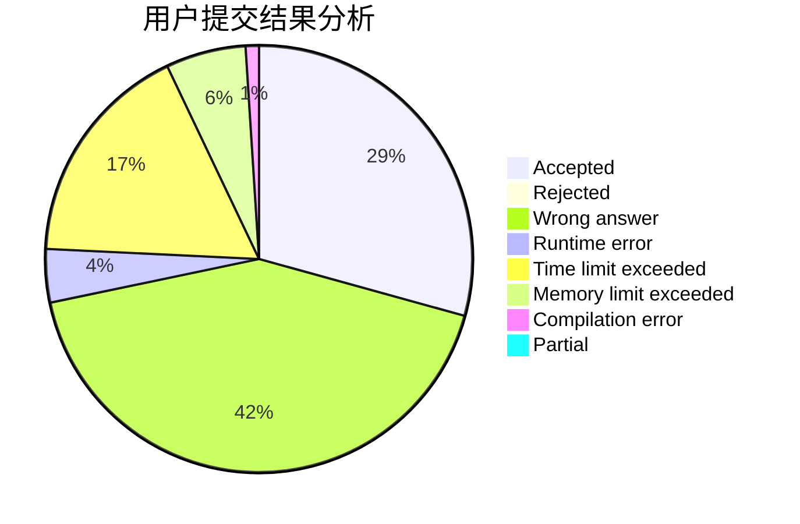
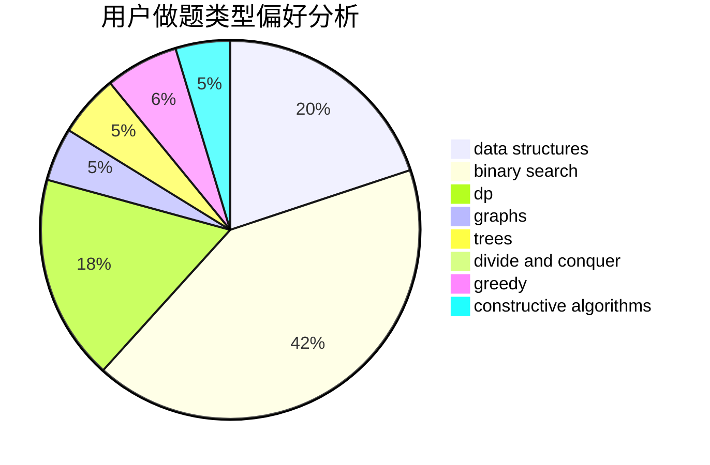
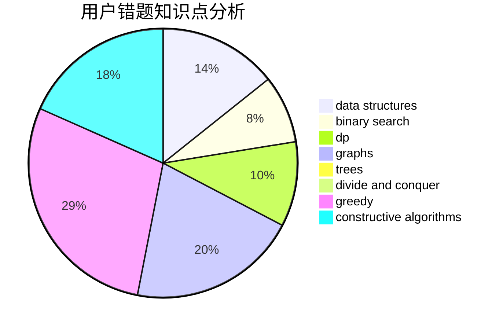

# yesky

<!-- tabs:start -->

#### **用户提交结果分析**

#### **用户做题类型偏好分析**

#### **用户错题知识点分析**

<!-- tabs:end -->
# 推荐题目
[1435A](https://codeforces.com/contest/1435/problem/A)		dsu,graphs,sortings,trees		  
[689B](https://codeforces.com/contest/689/problem/B)		dfs and similar,
                        graphs,
                        greedy,
                        shortest paths		  
[251B](https://codeforces.com/contest/251/problem/B)		implementation,
                        math		  
[920E](https://codeforces.com/contest/920/problem/E)		data structures,
                        dfs and similar,
                        dsu,
                        graphs		  
[407E](https://codeforces.com/contest/407/problem/E)		data structures		  
[799F](https://codeforces.com/contest/799/problem/F)		data structures		  
[764B](https://codeforces.com/contest/764/problem/B)		constructive algorithms,
                        implementation		  
[1176F](https://codeforces.com/contest/1176/problem/F)		dp,
                        implementation,
                        sortings		  
[877C](https://codeforces.com/contest/877/problem/C)		constructive algorithms		  
[472D](https://codeforces.com/contest/472/problem/D)		dfs and similar,
                        dsu,
                        shortest paths,
                        trees		  
