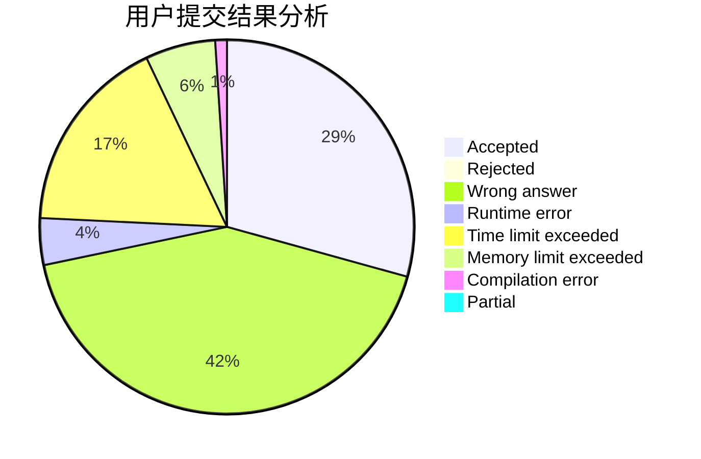
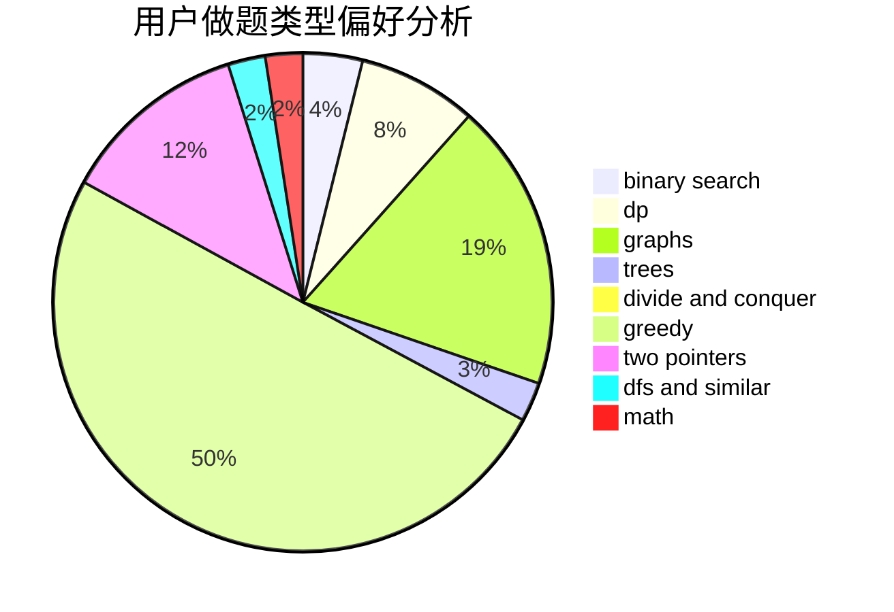

# yesky

<!-- tabs:start -->

#### **用户提交结果分析**

#### **用户做题类型偏好分析**

<!-- tabs:end -->
# 推荐题目
[1445A](https://codeforces.com/contest/1445/problem/A)
[70A](https://codeforces.com/contest/70/problem/A)
[269D](https://codeforces.com/contest/269/problem/D)
[940D](https://codeforces.com/contest/940/problem/D)
[436C](https://codeforces.com/contest/436/problem/C)
[813F](https://codeforces.com/contest/813/problem/F)
[782E](https://codeforces.com/contest/782/problem/E)
[117D](https://codeforces.com/contest/117/problem/D)
[898B](https://codeforces.com/contest/898/problem/B)
[491B](https://codeforces.com/contest/491/problem/B)
