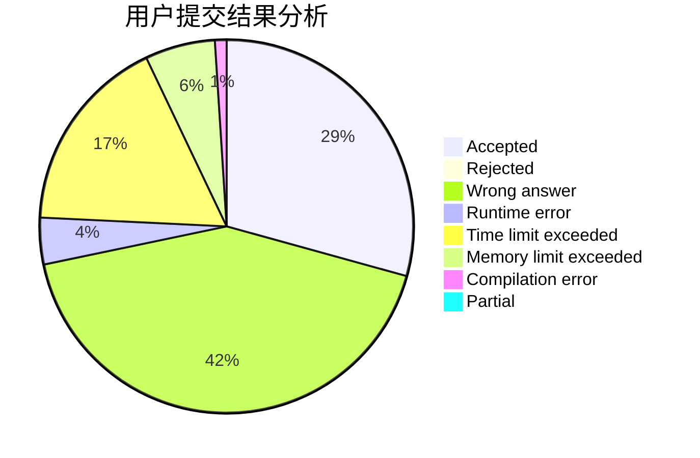
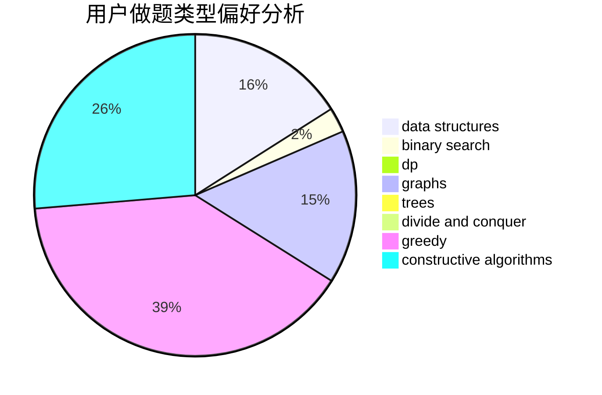
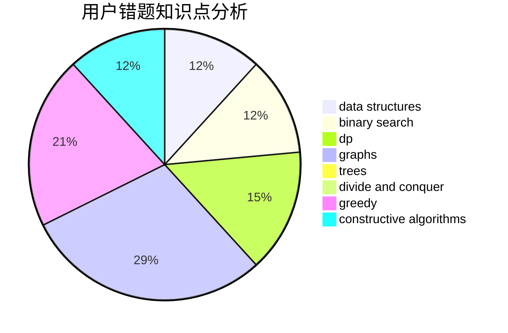

# yesky

<!-- tabs:start -->

#### **用户提交结果分析**

#### **用户做题类型偏好分析**

#### **用户错题知识点分析**

<!-- tabs:end -->
# 推荐题目
[1445A](https://codeforces.com/contest/1445/problem/A)		greedy,
                        sortings		  
[70A](https://codeforces.com/contest/70/problem/A)		math		  
[269D](https://codeforces.com/contest/269/problem/D)		data structures,
                        dp,
                        graphs,
                        sortings		  
[940D](https://codeforces.com/contest/940/problem/D)		binary search,
                        implementation		  
[436C](https://codeforces.com/contest/436/problem/C)		dsu,
                        graphs,
                        greedy,
                        trees		  
[813F](https://codeforces.com/contest/813/problem/F)		data structures,
                        dsu,
                        graphs		  
[782E](https://codeforces.com/contest/782/problem/E)		dsu,graphs,sortings,trees		  
[117D](https://codeforces.com/contest/117/problem/D)		divide and conquer,
                        math		  
[898B](https://codeforces.com/contest/898/problem/B)		brute force,
                        implementation,
                        number theory		  
[491B](https://codeforces.com/contest/491/problem/B)		greedy,
                        math		  
