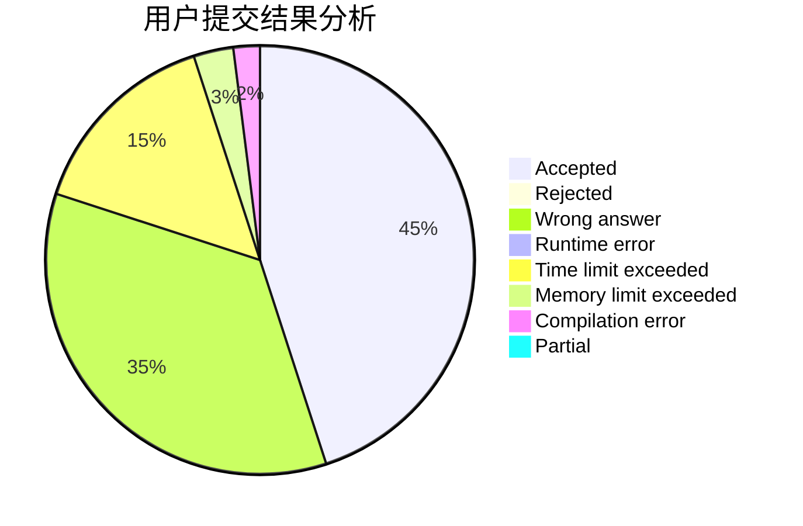
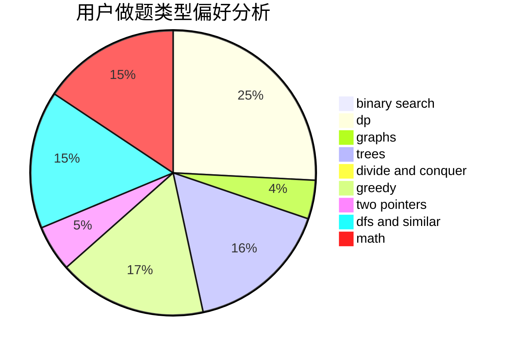

# yeuyeu

<!-- tabs:start -->

#### **用户提交结果分析**

#### **用户做题类型偏好分析**

<!-- tabs:end -->
# 推荐题目
[429A](https://codeforces.com/contest/429/problem/A)
[1302F](https://codeforces.com/contest/1302/problem/F)
[1210C](https://codeforces.com/contest/1210/problem/C)
[253A](https://codeforces.com/contest/253/problem/A)
[34A](https://codeforces.com/contest/34/problem/A)
[735A](https://codeforces.com/contest/735/problem/A)
[29B](https://codeforces.com/contest/29/problem/B)
[1300E](https://codeforces.com/contest/1300/problem/E)
[288D](https://codeforces.com/contest/288/problem/D)
[596D](https://codeforces.com/contest/596/problem/D)
