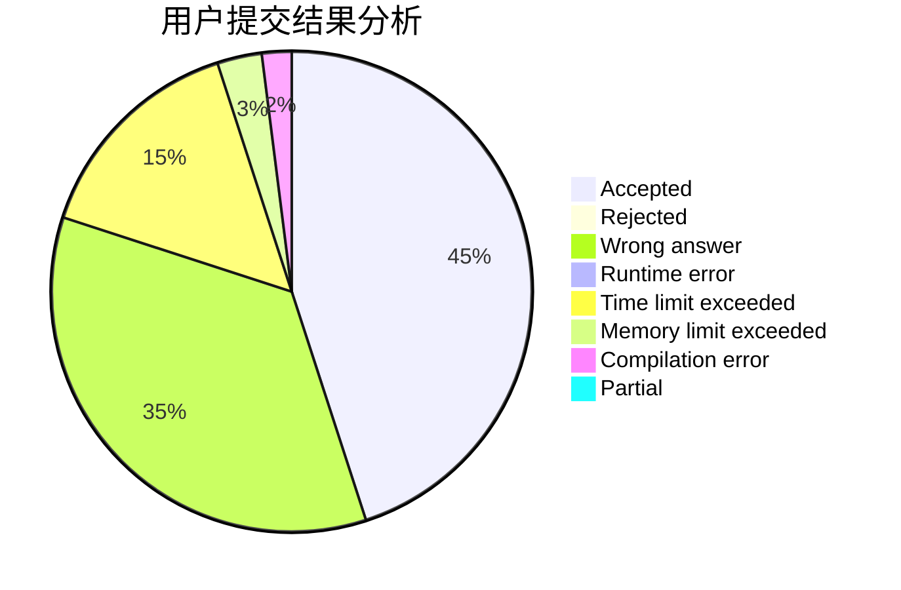
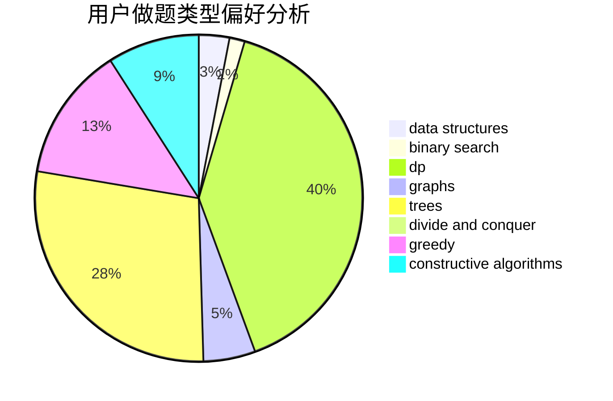
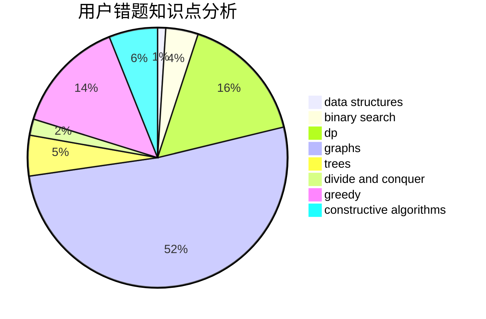

# yeuyeu

<!-- tabs:start -->

#### **用户提交结果分析**

#### **用户做题类型偏好分析**

#### **用户错题知识点分析**

<!-- tabs:end -->
# 推荐题目
[429A](https://codeforces.com/contest/429/problem/A)		dfs and similar,
                        trees		  
[1302F](https://codeforces.com/contest/1302/problem/F)		bitmasks,
                        brute force,
                        expression parsing		  
[1210C](https://codeforces.com/contest/1210/problem/C)		math,
                        number theory,
                        trees		  
[253A](https://codeforces.com/contest/253/problem/A)		greedy		  
[34A](https://codeforces.com/contest/34/problem/A)		implementation		  
[735A](https://codeforces.com/contest/735/problem/A)		implementation,
                        strings		  
[29B](https://codeforces.com/contest/29/problem/B)		implementation		  
[1300E](https://codeforces.com/contest/1300/problem/E)		dsu,graphs,sortings,trees		  
[288D](https://codeforces.com/contest/288/problem/D)		combinatorics,
                        dfs and similar,
                        trees		  
[596D](https://codeforces.com/contest/596/problem/D)		dp,
                        math,
                        probabilities,
                        sortings		  
