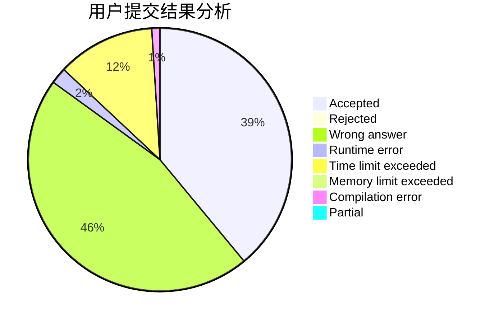
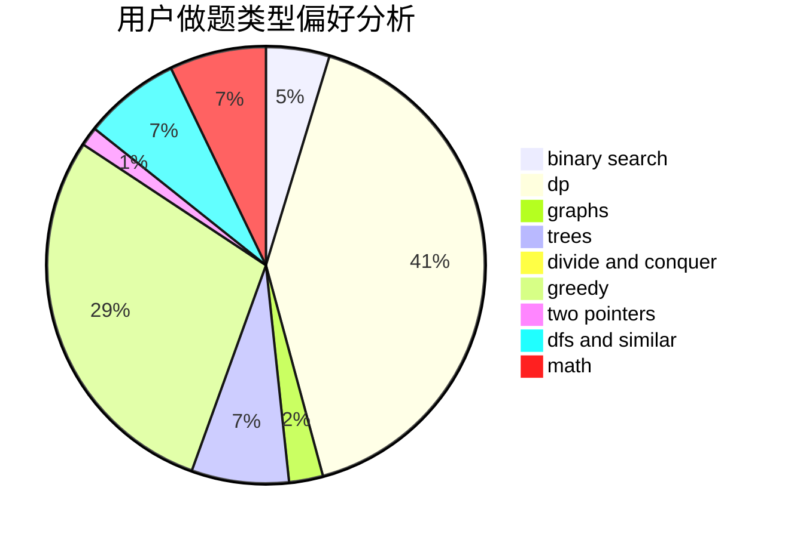

# yeye

<!-- tabs:start -->

#### **用户提交结果分析**

#### **用户做题类型偏好分析**

<!-- tabs:end -->
# 推荐题目
[212E](https://codeforces.com/contest/212/problem/E)
[1088B](https://codeforces.com/contest/1088/problem/B)
[1188E](https://codeforces.com/contest/1188/problem/E)
[962G](https://codeforces.com/contest/962/problem/G)
[418D](https://codeforces.com/contest/418/problem/D)
[601A](https://codeforces.com/contest/601/problem/A)
[171F](https://codeforces.com/contest/171/problem/F)
[938E](https://codeforces.com/contest/938/problem/E)
[1187G](https://codeforces.com/contest/1187/problem/G)
[837G](https://codeforces.com/contest/837/problem/G)
