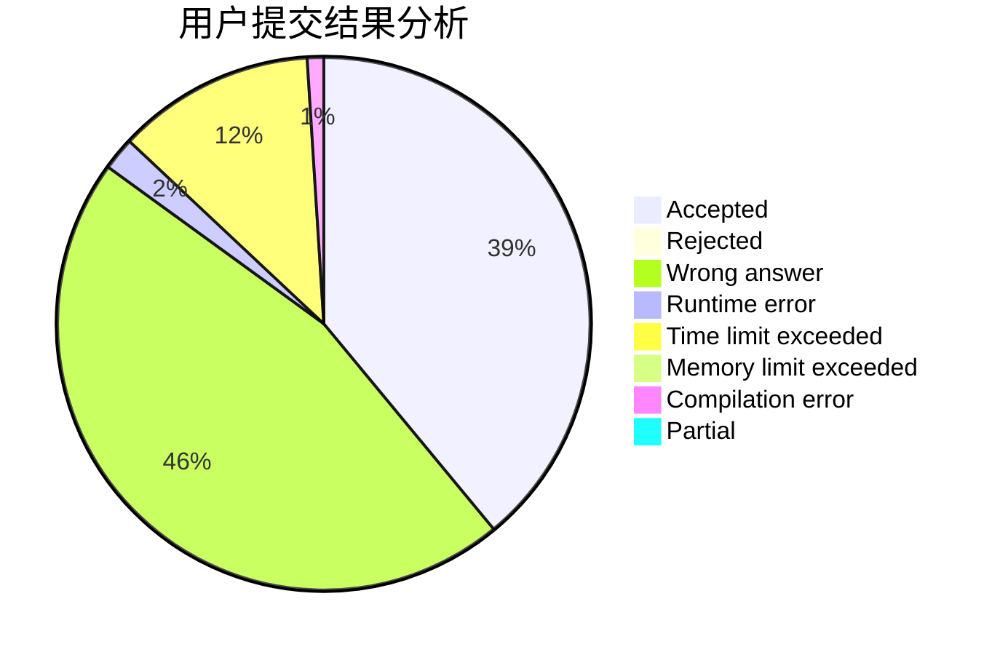
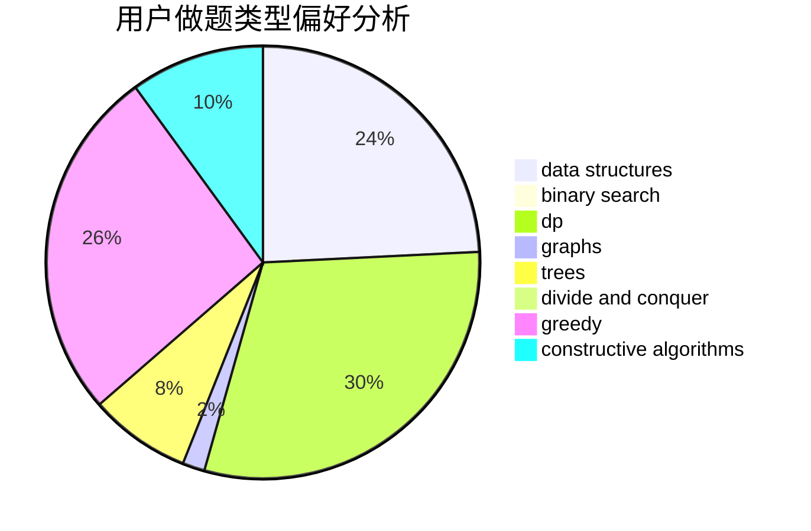

# yeye

<!-- tabs:start -->

#### **用户提交结果分析**

#### **用户做题类型偏好分析**

#### **用户错题知识点分析**

<!-- tabs:end -->
# 推荐题目
[212E](https://codeforces.com/contest/212/problem/E)		dfs and similar,
                        dp,
                        trees		  
[1088B](https://codeforces.com/contest/1088/problem/B)		implementation,
                        sortings		  
[1188E](https://codeforces.com/contest/1188/problem/E)		combinatorics		  
[962G](https://codeforces.com/contest/962/problem/G)		data structures,
                        dsu,
                        geometry,
                        trees		  
[418D](https://codeforces.com/contest/418/problem/D)		data structures,
                        graphs,
                        trees		  
[601A](https://codeforces.com/contest/601/problem/A)		graphs,
                        shortest paths		  
[171F](https://codeforces.com/contest/171/problem/F)		*special problem,
                        brute force,
                        implementation,
                        number theory		  
[938E](https://codeforces.com/contest/938/problem/E)		combinatorics,
                        math		  
[1187G](https://codeforces.com/contest/1187/problem/G)		flows,
                        graphs		  
[837G](https://codeforces.com/contest/837/problem/G)		data structures		  
