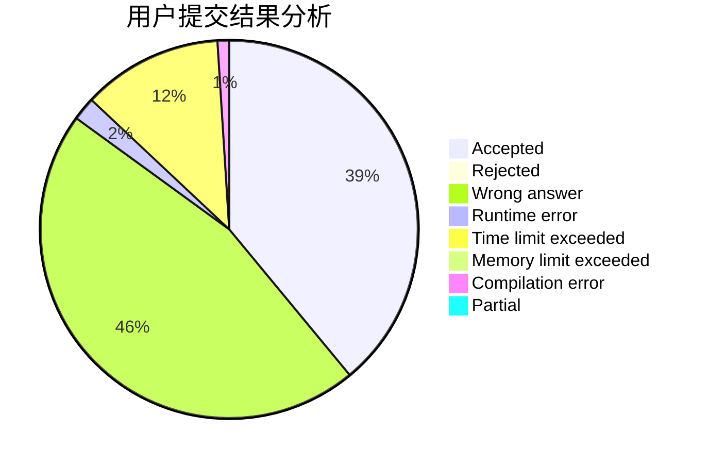
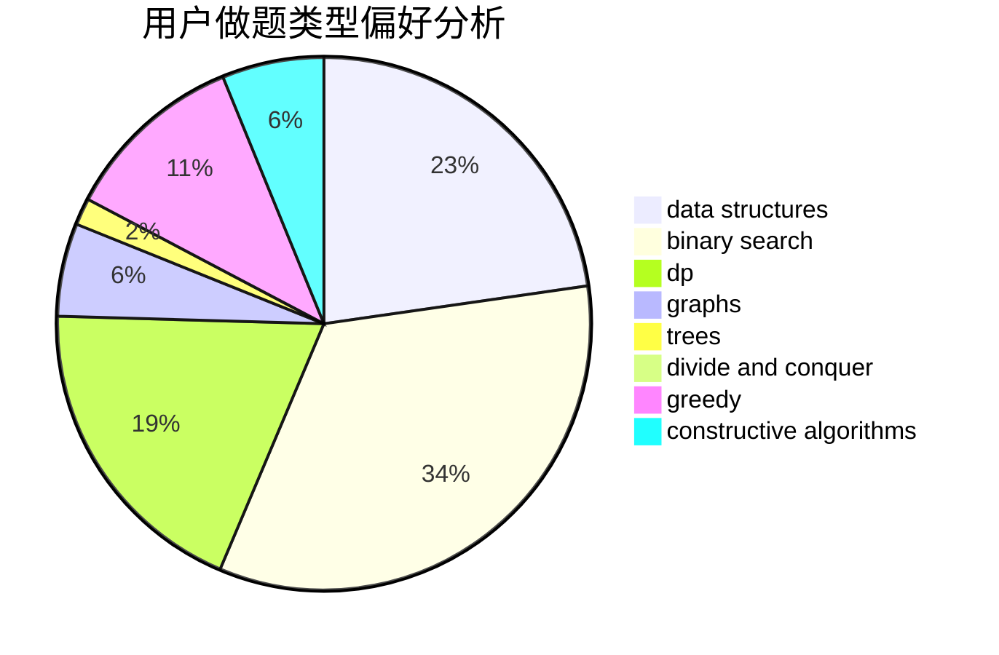

# yeye

<!-- tabs:start -->

#### **用户提交结果分析**

#### **用户做题类型偏好分析**

#### **用户错题知识点分析**

<!-- tabs:end -->
# 推荐题目
[189A](https://codeforces.com/contest/189/problem/A)		brute force,
                        dp		  
[1087E](https://codeforces.com/contest/1087/problem/E)		dsu,graphs,sortings,trees		  
[1184E3](https://codeforces.com/contest/1184E/problem/3)		data structures,
                        dsu,
                        graphs,
                        trees		  
[946C](https://codeforces.com/contest/946/problem/C)		greedy,
                        strings		  
[389B](https://codeforces.com/contest/389/problem/B)		greedy,
                        implementation		  
[580E](https://codeforces.com/contest/580/problem/E)		data structures,
                        hashing,
                        strings		  
[1512F](https://codeforces.com/contest/1512/problem/F)		brute force,
                        dp,
                        greedy,
                        implementation		  
[918B](https://codeforces.com/contest/918/problem/B)		implementation,
                        strings		  
[1184C1](https://codeforces.com/contest/1184C/problem/1)		implementation		  
[818A](https://codeforces.com/contest/818/problem/A)		implementation,
                        math		  
