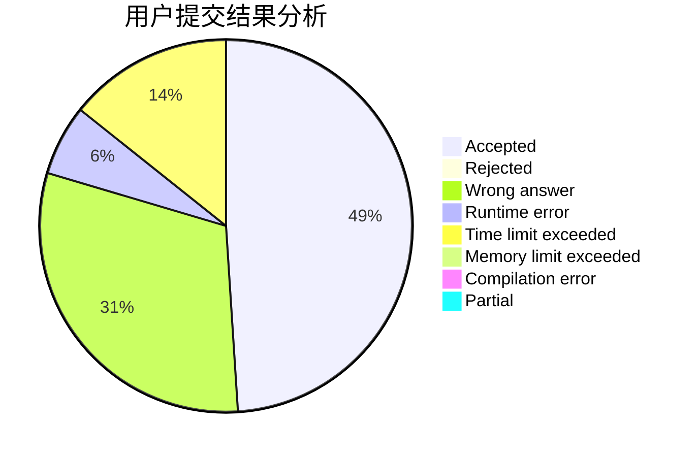
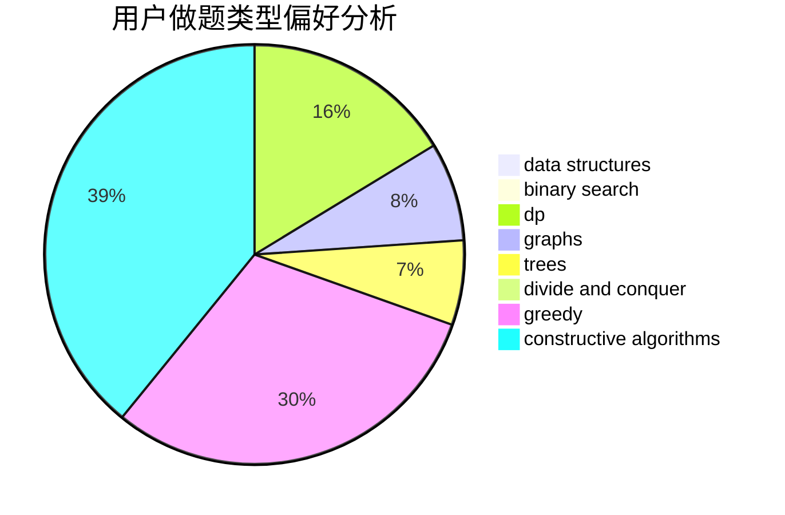
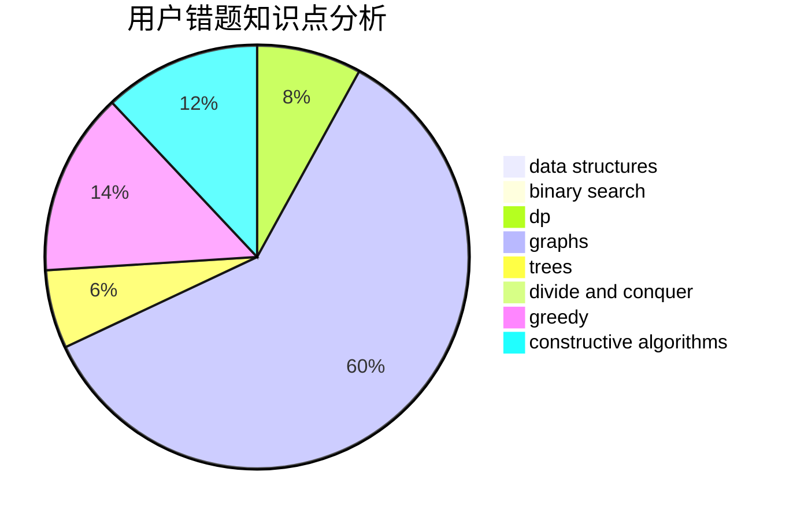

# ygsldcyc

<!-- tabs:start -->

#### **用户提交结果分析**

#### **用户做题类型偏好分析**

#### **用户错题知识点分析**

<!-- tabs:end -->
# 推荐题目
[715A](https://codeforces.com/contest/715/problem/A)		constructive algorithms,
                        math		  
[1087D](https://codeforces.com/contest/1087/problem/D)		dsu,graphs,sortings,trees		  
[293B](https://codeforces.com/contest/293/problem/B)		brute force,
                        combinatorics		  
[501E](https://codeforces.com/contest/501/problem/E)		binary search,
                        combinatorics,
                        implementation		  
[920G](https://codeforces.com/contest/920/problem/G)		binary search,
                        bitmasks,
                        brute force,
                        combinatorics,
                        math,
                        number theory		  
[acmsguru5](https://codeforces.com/contest/acmsguru/problem/5)		dsu,graphs,sortings,trees		  
[212A](https://codeforces.com/contest/212/problem/A)		flows,
                        graphs		  
[1073B](https://codeforces.com/contest/1073/problem/B)		implementation,
                        math		  
[1036C](https://codeforces.com/contest/1036/problem/C)		combinatorics,
                        dp		  
[750E](https://codeforces.com/contest/750/problem/E)		data structures,
                        divide and conquer,
                        dp,
                        matrices		  
